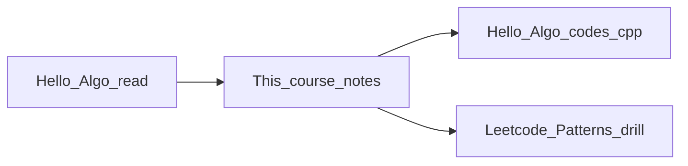
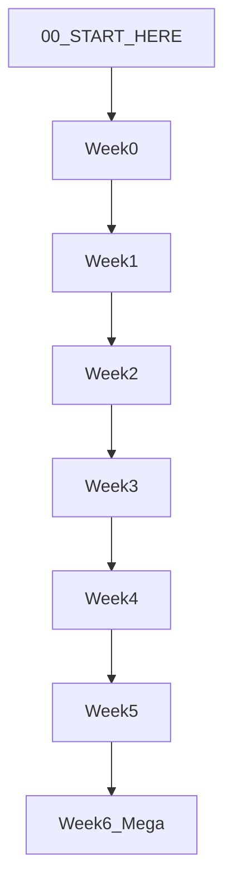

# DSA + LeetCode Patterns — Start Here

Welcome. This folder is a **complete, beginner-friendly course** that combines:

- **[Hello 算法 / Hello Algo](https://github.com/krahets/hello-algo/)** — data structures and algorithms from first principles (see [hello-algo.com/en/](https://www.hello-algo.com/en/))
- **[Leetcode Patterns](https://seanprashad.com/leetcode-patterns/)** — interview problems grouped by **pattern** (recognize the shape, pick the tool)

You do not need to read those sites cover-to-cover first. These notes reorganize the same ideas into **Weeks 0–6**, with **C++** examples, practice problems, worked pattern solutions, and a **Final Mega Project**.

---

## Who this is for

- You are new to **data structures and algorithms** or feel stuck random-solving LeetCode.
- You want **end-to-end understanding**, not memorized solutions.
- You are preparing for **coding interviews** (FAANG-style or general SWE).

**Prerequisites:**

- Basic programming: variables, loops, functions, classes.
- Comfort installing a C++ compiler (`g++` C++17 is enough for examples).

You do **not** need a CS degree.

---

## What “DSA” means in one sentence

**Data structures** are ways to organize data; **algorithms** are step-by-step procedures that use those structures to solve problems **efficiently**.

In interviews you must: **understand the problem → pick a pattern → state complexity → write clean C++ → test edge cases**.

---

## DSA learning vs “LeetCode grinding”

| Grinding only | This course |
|---------------|-------------|
| 500 problems, weak fundamentals | Foundations first, then patterns |
| Copy solutions | Implement + explain why |
| Skip complexity | Big-O every time |
| One language tricks | C++ + links to Hello Algo `codes/cpp/` |

LeetCode is the **gym**; Hello Algo is the **anatomy textbook**; this repo is your **training plan**.

---

## How the two sources fit together

1. **Read** the week’s lesson files here (concepts in plain English).
2. **Run** matching topics in Hello Algo’s C++ code ([`codes/cpp/`](https://github.com/krahets/hello-algo/tree/main/codes/cpp)) for animations and full implementations.
3. **Drill** weekly practice problems; tag each with a **pattern** from Leetcode Patterns.
4. **Week 6:** pattern playbook + mega project tying implementations together.

Hello Algo content is [CC BY-NC-SA 4.0](https://github.com/krahets/hello-algo/blob/main/LICENSE). These notes are original summaries; always refer to Hello Algo for official figures and runnable chapters.

---

## Weekly roadmap

| Week | Folder | Focus |
|------|--------|--------|
| **0** | [week-0-orientation/](week-0-orientation/) | What DSA is, study workflow, interview steps, complexity primer |
| **1** | [week-1-arrays-and-lists/](week-1-arrays-and-lists/) | DS overview, arrays, linked lists, recursion, Big-O deep dive |
| **2** | [week-2-stack-queue-hash-patterns/](week-2-stack-queue-hash-patterns/) | Stack, queue, hash table, two pointers, sliding window |
| **3** | [week-3-trees-heap-search/](week-3-trees-heap-search/) | Trees, BST, heap, binary search patterns |
| **4** | [week-4-graphs-and-sorting/](week-4-graphs-and-sorting/) | Graphs BFS/DFS, sorting, union-find, intervals |
| **5** | [week-5-backtracking-greedy/](week-5-backtracking-greedy/) | Divide & conquer, backtracking, greedy, monotonic stack |
| **6** | [week-6-dp-patterns-mega-project/](week-6-dp-patterns-mega-project/) | DP, full pattern playbook, worked solutions, **Mega Project** |

File names are numbered (`1.1`, `1.2`, …) — read in order within each week.

---

## Study rhythm (about 8–12 hours / week)

1. Read lessons for that week.
2. Code along in Hello Algo C++ for the same chapter.
3. Solve **practice-problems** without reading solutions first (45–90 min).
4. One **LeetCode Easy/Medium** per pattern from the week’s list.
5. Write a one-paragraph **“when I use this pattern”** note in your own words.

**Short timeline (interview in 3 weeks):** Week 0 + 1 + pattern table + Week 6 playbook + 30 curated problems.  
**Full timeline:** All weeks 0→6 + mega project.

---

## File types in this course

| Pattern | Purpose |
|---------|---------|
| `X.Y-topic-name.md` | Lesson: concept, example, C++, pattern hint, recap |
| `X.Y-practice-problems.md` | Problems + guided **C++17** solutions |
| `6.4` … `6.8` | Worked pattern walkthroughs |
| `6.9-FINAL-MEGA-PROJECT.md` | Capstone: build DS + integrate + 15-problem checklist |

**All code examples in this course use C++** unless noted otherwise.

---

## Glossary (quick map)

| Term | Meaning |
|------|---------|
| **Big-O** | How time/space grows with input size n |
| **Invariant** | A condition that stays true during a loop/recursion |
| **Pattern** | Reusable problem shape (e.g. sliding window) |
| **Two pointers** | Two indices moving over array/string |
| **Sliding window** | Subarray/substring with fixed or variable size |
| **BFS / DFS** | Breadth-first / depth-first graph or tree traversal |
| **BST** | Binary search tree: left < root < right |
| **Heap** | Complete tree; min-heap parent ≤ children |
| **Backtracking** | Try choice → recurse → undo |
| **DP** | Optimal substructure + overlapping subproblems |
| **Union-Find** | Disjoint sets with near-O(1) merge/find |

---

## Pattern decision table (from [Leetcode Patterns](https://seanprashad.com/leetcode-patterns/) heuristics)

Use when you are stuck — not as a substitute for thinking.

### Arrays and strings

| If you see… | Try… |
|-------------|------|
| Sorted input | Binary search, two pointers |
| Need O(1) lookup | Hash map / hash set |
| Must solve in-place | Swap elements, two pointers |
| Substrings / subarrays max/min | Sliding window, prefix sum |
| Next greater/smaller element | Monotonic stack |
| Range sum queries | Prefix sum, segment tree (advanced) |

### Trees and graphs

| If you see… | Try… |
|-------------|------|
| Tree | DFS (pre/in/post), BFS (level order) |
| Graph | BFS, DFS, union-find |
| Matrix as grid | BFS/DFS, DP |
| Connectivity / groups | Union-find, DFS |
| Ordering with dependencies | Topological sort |

### Other

| If you see… | Try… |
|-------------|------|
| Top / smallest K | Heap, quickselect |
| Merge sorted lists/intervals | Merge sort pattern, heap |
| Overlapping intervals | Sort by start, sweep |
| All subsets/permutations | Backtracking |
| Count ways / optimize choice | DP, greedy (prove!) |
| Linked list cycle/mid | Fast & slow pointers |
| Stream / median | Two heaps, heap |

---

## Suggested LeetCode tags by week (representative)

| Week | Examples (LC #) |
|------|-----------------|
| 1 | 26, 27, 21, 206 |
| 2 | 1, 242, 3, 53, 125 |
| 3 | 230, 98, 33, 704 |
| 4 | 200, 207, 56, 347 |
| 5 | 78, 39, 55, 739 |
| 6 | 70, 322, 1143, 72 + mega set in 6.9 |

---

## Roadmap diagram

---

## Start now

Open **[week-0-orientation/0.1-what-is-dsa-and-algorithms.md](week-0-orientation/0.1-what-is-dsa-and-algorithms.md)** and proceed in order.

When you finish Week 6, complete **[week-6-dp-patterns-mega-project/6.9-FINAL-MEGA-PROJECT.md](week-6-dp-patterns-mega-project/6.9-FINAL-MEGA-PROJECT.md)** before reading the reference implementations.

Good luck — patterns become obvious with deliberate practice.
