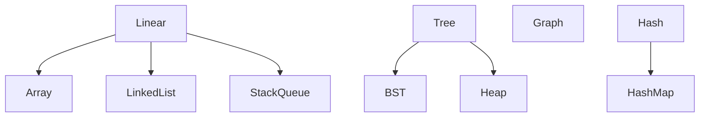

# Data Structures Overview

## What is it, in one line?

A **data structure** is a way to **store and organize** data so common operations (read, insert, delete, search) match your problem’s needs.

Hello Algo **Chapter 3**: [Classification of data structures](https://www.hello-algo.com/en/chapter_data_structure/classification_of_data_structure/).

---

## Why it exists

Same data, different access patterns → different best structures. Wrong choice = slow product.

---

## Logical vs physical

| View | Example |
|------|---------|
| **Logical** | “Stack” = LIFO behavior |
| **Physical** | Array or linked list backing the stack |

Interviews test **logical** behavior + **complexity** of operations.

---

## Major families (course map)

---

## Operation complexity cheat sheet (typical)

| Structure | Access | Search | Insert | Delete |
|-----------|--------|--------|--------|--------|
| Array | O(1) index | O(n) | O(n) tail | O(n) mid |
| Linked list | O(n) | O(n) | O(1) if ptr | O(1) if ptr |
| Hash map | — | O(1)* avg | O(1)* avg | O(1)* avg |
| BST balanced | — | O(log n) | O(log n) | O(log n) |

*Average case; worst-case hash O(n) if poor hashing.

---

## Real-world

- **Array/vector:** frame buffers, batch processing.
- **Hash map:** symbol tables in compilers, caches.
- **Tree:** file systems, DOM, DB indexes.
- **Graph:** social networks, routing.

---

## Recap

- Pick structure by **operations** you need often.
- Next: [1.2-arrays-and-dynamic-arrays.md](1.2-arrays-and-dynamic-arrays.md)
