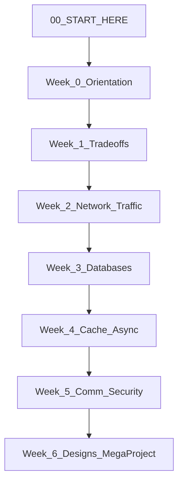

# System Design Learning Course — Start Here

Welcome. This folder is a **complete, beginner-friendly course** based on the ideas in [The System Design Primer](https://github.com/donnemartin/system-design-primer). You do not need to read that repo line-by-line; these notes reorganize the same topics into **Weeks 0–6**, with explanations, real-world examples, practice problems, worked designs, and a final mega project.

---

## Who this is for

- You are new to **system design** (how large apps like Netflix, Twitter, or Amazon are built).
- You want to **learn end to end**, not just memorize buzzwords.
- You may also be preparing for **system design interviews** — this course covers that process explicitly in Week 0 and Week 6.

**Prerequisites (helpful, not mandatory):**

- Basic programming (variables, APIs, “client talks to server”).
- Rough idea of what a **database** and **web request** are.
- Willingness to sketch boxes and arrows on paper or in a tool.

You do **not** need prior experience designing data centers or distributed systems.

---

## What “system design” means in one sentence

**System design** is deciding how software, data, and infrastructure work together so a product stays **fast, reliable, and affordable** as users and data grow.

In interviews and in real jobs, you:

1. Clarify **who** uses the system and **what** it must do.
2. Draw **components** (clients, servers, databases, caches, queues).
3. Explain **trade-offs** (speed vs consistency, cost vs complexity).
4. Show how you would **scale** when traffic or data increases.

---

## How this course is organized

| Week | Folder | What you learn |
|------|--------|----------------|
| **0** | [week-0-orientation/](week-0-orientation/) | What system design is, the 4-step interview framework, back-of-envelope math |
| **1** | [week-1-foundations-tradeoffs/](week-1-foundations-tradeoffs/) | Performance vs scalability, latency vs throughput, CAP, consistency & availability |
| **2** | [week-2-networking-traffic/](week-2-networking-traffic/) | DNS, CDN, load balancers, reverse proxies, microservices |
| **3** | [week-3-databases/](week-3-databases/) | SQL scaling (replication, sharding, …), NoSQL types, when to pick which |
| **4** | [week-4-caching-and-asynchronism/](week-4-caching-and-asynchronism/) | Caches at every layer, cache update patterns, message & task queues |
| **5** | [week-5-communication-and-security/](week-5-communication-and-security/) | HTTP, TCP/UDP, RPC vs REST, security basics, object-oriented design |
| **6** | [week-6-designs-and-mega-project/](week-6-designs-and-mega-project/) | Full worked solutions (Pastebin, Twitter, …) + **Final Mega Project** |

Each week has **multiple markdown files** (topics split for easier reading). File names are numbered so you know the suggested order (e.g. `1.1`, then `1.2`, …).

---

## How to use these materials

### Suggested weekly rhythm (about 8–12 hours per week)

1. **Read** topic files in order for that week (take notes in your own words).
2. **Sketch** one diagram per major topic (paper is fine).
3. **Do** that week’s `*-practice-problems.md` — try yourself first, then read guided solutions.
4. **Recap** using the “Recap” section at the end of each topic file.

### Short timeline (e.g. interview in 2–3 weeks)

- Skim all weeks for **breadth**.
- Deep-dive Week 0 + Week 6 framework and **2–3** design solutions.
- Practice explaining designs **out loud** for 35–45 minutes.

### Medium timeline (6–8 weeks)

- Follow weeks **0 → 6** in order.
- Complete **all** practice problem sets.
- Work through **most** of the eight designs in Week 6.

### Long timeline (3+ months)

- Same as medium, plus re-read trade-off weeks (1, 3, 4).
- Build the **Final Mega Project** twice: once alone, once comparing to the reference solution.

---

## File types in this course

| Pattern | Purpose |
|---------|---------|
| `X.Y-topic-name.md` | **Lesson** — concept, why it exists, deep dive, real example, diagram, trade-offs, interview tips, recap |
| `X.Y-practice-problems.md` | **Practice** — questions + guided solutions (try before reading answers) |
| `6.2` … `6.9` | **Worked system designs** — full walkthroughs aligned with the Primer’s classic problems |
| `6.10-FINAL-MEGA-PROJECT.md` | **Capstone** — one large design using everything from Weeks 0–6 |

---

## Master glossary — what is what

Use this table when you see a term in later weeks. Each topic has a full lesson; this is your **map**.

### Foundations and trade-offs

| Term | One-line meaning | Real-world touchpoint |
|------|------------------|------------------------|
| **Performance** | How fast the system feels for **one** user | A single search on Google returning in 200 ms |
| **Scalability** | Ability to stay fast/correct when **load** grows | Black Friday traffic on Amazon |
| **Latency** | Time for **one** operation to finish | Time from tap “Play” to first video frame |
| **Throughput** | **How many** operations per second | Tweets ingested per second worldwide |
| **Availability** | System responds (uptime %) | “99.99%” ≈ ~52 min downtime/year |
| **Consistency** | Every read sees the latest write (or an error) | Bank balance after a transfer |
| **CAP theorem** | In a network partition, pick **C** or **A** (P is required) | Choosing AP for a social “like” count vs CP for inventory |
| **Eventual consistency** | Replicas catch up after a short delay | DNS or CDN updates worldwide |
| **Failover** | Standby takes over when primary dies | Database primary → replica promotion |
| **Replication** | Copy data to multiple nodes | MySQL read replicas |

### Traffic and edge

| Term | One-line meaning | Real-world touchpoint |
|------|------------------|------------------------|
| **DNS** | Maps names (`amazon.com`) to IP addresses | Browser finding which server to contact |
| **CDN** | Caches static content **near users** | Netflix serving video from a local edge POP |
| **Load balancer** | Spreads requests across many servers | AWS ELB in front of web tier |
| **Reverse proxy** | Single public face; forwards to internal services | NGINX in front of app servers |
| **Horizontal scaling** | Add **more** machines | More API servers instead of one bigger CPU |
| **Vertical scaling** | Bigger **one** machine | Upgrading RAM on a single DB (limited) |
| **Microservices** | Small services, each owns one job | Uber: trips, payments, maps as separate services |
| **Service discovery** | Services find each other’s addresses | Consul / Kubernetes DNS for “where is auth-service?” |

### Data

| Term | One-line meaning | Real-world touchpoint |
|------|------------------|------------------------|
| **RDBMS / SQL** | Tables, rows, ACID transactions | PostgreSQL for orders and payments |
| **Master-slave replication** | One writer, many read copies | Read scaling for product catalog |
| **Sharding** | Split rows across DBs by key | Instagram sharding users by user id |
| **Federation** | Split by **feature** (users vs posts DB) | Early Twitter splitting services |
| **Denormalization** | Duplicate data to avoid slow joins | Storing author name on each comment row |
| **NoSQL** | Non-relational stores (many shapes) | DynamoDB, MongoDB, Cassandra |
| **Key-value store** | Get/set by key | Redis session cache, DynamoDB |
| **Document store** | JSON-like documents | MongoDB user profiles |
| **Wide-column store** | Rows with many columns, partition-friendly | Cassandra time-series |
| **Graph DB** | Nodes and edges | Neo4j friend recommendations |

### Speed and async

| Term | One-line meaning | Real-world touchpoint |
|------|------------------|------------------------|
| **Cache** | Fast copy of slow data | Redis in front of PostgreSQL |
| **Cache-aside** | App reads cache, on miss loads DB then fills cache | Classic web app pattern |
| **Write-through** | Write to cache and DB together | Stronger cache/DB alignment |
| **Message queue** | Async buffer between services | SQS, Kafka for order events |
| **Task queue** | Background workers process jobs | Celery/RabbitMQ for email sends |
| **Back pressure** | Slow down producers when consumers overload | Kafka consumer lag handling |

### Communication and safety

| Term | One-line meaning | Real-world touchpoint |
|------|------------------|------------------------|
| **HTTP** | Web request/response protocol | REST APIs in browsers and mobile apps |
| **TCP** | Reliable, ordered byte stream | HTTPS, most APIs |
| **UDP** | Fast, no guarantee of delivery | Video calls, DNS, gaming |
| **RPC** | Call a function on another machine | gRPC between internal microservices |
| **REST** | Resources + HTTP verbs | Public JSON APIs |
| **SSL/TLS termination** | Decrypt HTTPS at load balancer | Certificates only on LB, not every app server |

---

## The four-step design framework (preview)

You will practice this in [week-0-orientation/0.2-how-to-approach-a-design-interview.md](week-0-orientation/0.2-how-to-approach-a-design-interview.md) and again in Week 6.

1. **Requirements** — users, features, scale, read/write ratio, constraints.
2. **High-level design** — main boxes and arrows (client → LB → app → DB/cache).
3. **Core components** — APIs, data model, algorithms (e.g. short URL generation).
4. **Scale** — bottlenecks, caching, sharding, async, trade-offs.

Always say: **“It depends — here is the trade-off.”**

---

## Roadmap diagram

---

## Week 6 designs you will master

These mirror the classic problems in the System Design Primer:

1. Pastebin / URL shortener (Bit.ly)
2. Twitter timeline and search (Facebook feed)
3. Web crawler
4. Mint.com (aggregation / sync)
5. Social network data structures
6. Key-value store for search
7. Amazon sales ranking by category
8. Scale to millions of users on AWS

Then: **Final Mega Project** — design a global video + social platform end to end.

---

## Study tips that actually work

- **Talk out loud** — interviews are conversations, not silent exams.
- **Use round numbers** — “100 million users, 10% daily active, 2 reads per user per day” (Week 0 math).
- **Name one company example** per component you propose.
- **Do not** aim to memorize every technology — aim to know **when** and **why** you would use a pattern.
- Revisit [week-1-foundations-tradeoffs/](week-1-foundations-tradeoffs/) whenever a design choice feels fuzzy — almost everything is a trade-off.

---

## Where to go first

Open **[week-0-orientation/0.1-what-is-system-design.md](week-0-orientation/0.1-what-is-system-design.md)** and work through Week 0 in numbered order.

When you finish Week 6, complete **[week-6-designs-and-mega-project/6.10-FINAL-MEGA-PROJECT.md](week-6-designs-and-mega-project/6.10-FINAL-MEGA-PROJECT.md)** without peeking at the reference solution until you have your own diagram and numbers.

Good luck — you are building the same mental models senior engineers use every day.
