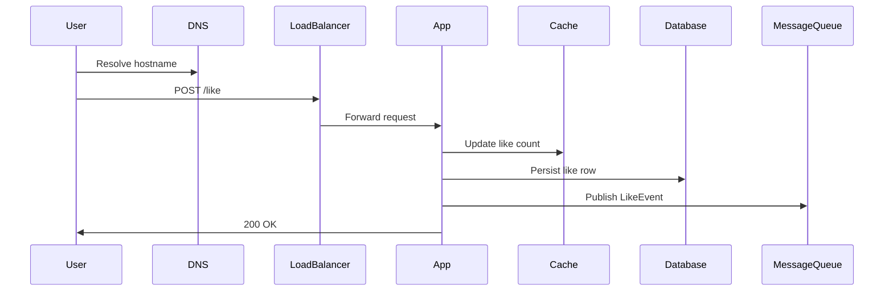

# What Is System Design?

## What is it, in one line?

**System design** is planning how all parts of a software product—apps, databases, caches, networks—work together so the product is correct, fast enough, and can grow.

---

## Why it exists

When you build a todo app for yourself, one server and one database is often enough. When **millions** of people use a product:

- One machine cannot hold all data or handle all requests.
- Parts fail (disks, networks, data centers); the product must still work.
- Teams need clear boundaries so many people can ship without breaking everything.

System design is the skill of making those plans **before** (or while) you build—and of explaining them to teammates and interviewers.

---

## The journey of a single user action (real-world example)

**Example: You “like” a post on Instagram.**

1. Your phone sends an HTTPS request over the internet.
2. **DNS** resolves `instagram.com` to an IP address.
3. Traffic may hit a **CDN** only for static assets; the “like” goes to the API.
4. A **load balancer** sends your request to one of many **application servers**.
5. The app may write to a **database** (who liked what) and update a **cache** (like count shown on the post).
6. A **message queue** might notify other systems (push notification, analytics).

None of this is magic—it is **layers of components**, each with a job. System design is choosing those layers and how they connect.

---

## Monolith vs distributed system

| Style | Idea | Example phase |
|-------|------|----------------|
| **Monolith** | One codebase, one deploy | Early startup MVP |
| **Distributed** | Many services/machines, coordinated | Netflix, Uber at scale |

You are not “better” for picking microservices on day one. Most successful companies **start simpler** and split when pain appears (team size, deploy conflicts, scaling one part only).

**Real-world:** Amazon started as a monolithic bookstore app; it evolved into hundreds of services as scale and teams grew.

---

## What system design is NOT

- **Not** picking AWS vs GCP as your personality—it is matching requirements to tools.
- **Not** memorizing that “Kafka fixes everything”—it is knowing when async messaging helps.
- **Not** only for interviews—staff engineers spend much of their time on design reviews.

---

## Core questions every design answers

1. **Functional:** What features? (upload file, shorten URL, show feed)
2. **Non-functional:** How fast? How available? How much data? How secure?
3. **Scale:** Users, requests/sec, storage growth, read vs write ratio
4. **Failure:** What happens when a server, zone, or network fails?

If you can answer these out loud with a diagram, you are doing system design.

---

## Relationship to this course

| Week | You learn to answer… |
|------|----------------------|
| 0 | How to structure thinking and estimate scale |
| 1 | Speed vs load, consistency vs uptime |
| 2 | How requests reach your code |
| 3 | Where data lives and grows |
| 4 | How to go faster and decouple work |
| 5 | How services talk and stay safe |
| 6 | Full designs + capstone |

---

## Common interview questions

- “Design a URL shortener.” → Tests basics: API, storage, scale, collisions.
- “How would you scale a read-heavy website?” → Caching, replicas, CDN.
- “What happens if the database goes down?” → Failover, replication, degraded mode.

---

## Recap

- System design = architecture for **growth and reliability**, not just code.
- Real systems are **layers**: DNS → LB → app → cache/DB → queues.
- Start from **user actions** and **numbers** (users, QPS, storage).
- Next: [0.2-how-to-approach-a-design-interview.md](0.2-how-to-approach-a-design-interview.md)
