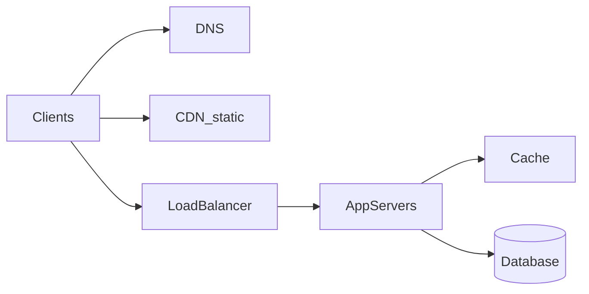

# How to Approach a System Design Interview (and Real Design Reviews)

## What is it, in one line?

A **structured conversation** where you clarify requirements, sketch architecture, detail important pieces, then scale—while stating trade-offs aloud.

Based on the framework from [The System Design Primer](https://github.com/donnemartin/system-design-primer).

---

## Why it exists

Open-ended questions like “Design Twitter” are intentionally vague. Interviewers want to see:

- Can you **ask good questions** instead of guessing?
- Can you **prioritize** (MVP vs nice-to-have)?
- Do you know **standard building blocks** (LB, cache, sharding)?
- Can you **estimate** scale and spot bottlenecks?

The same four steps work in **on-the-job** design docs and RFC reviews.

---

## Step 1: Outline use cases, constraints, and assumptions

**Goal:** Narrow the problem with the interviewer (or product doc).

### Questions to ask (pick what fits the problem)

| Category | Example questions |
|----------|-------------------|
| Users | Who uses it? Mobile, web, both? |
| Features | What are the top 3 must-have features for v1? |
| Scale | How many users? Daily active users (DAU)? |
| Traffic | Reads vs writes? Peak requests per second? |
| Data | How big is each record? Retention (keep forever?) |
| Latency | “Good enough” response time? |
| Consistency | Strong consistency required, or eventual OK? |

### Example: URL shortener (Pastebin / Bit.ly)

**You might agree:**

- Create short URL from long URL; redirect short → long.
- **Not** in v1: analytics dashboard, custom domains, edit after create.
- 100M new URLs/month, **read:write ≈ 100:1**.
- Short links must work for **10 years** (storage planning).
- Uniqueness: collision handling required.

Write these on the board—they become your **contract** for the rest of the session.

---

## Step 2: Create a high-level design

**Goal:** 5–7 boxes, one diagram, main data flow.

Typical web service skeleton:

**Say out loud:** “Reads hit cache when possible; writes go to DB and invalidate cache.”

Do **not** draw 40 boxes in the first five minutes. Add complexity in Step 4.

---

## Step 3: Design core components

**Goal:** Depth where the problem is unique—not generic “we use PostgreSQL.”

For each core feature, cover:

1. **API** — REST/RPC endpoints, request/response shape.
2. **Data model** — tables or documents, keys, indexes.
3. **Algorithms** — hashing, ID generation, ranking, fan-out.
4. **Consistency** — what must be atomic vs async.

### URL shortener — core detail sketch

**API:**

- `POST /v1/urls` — body: `{ "long_url": "https://..." }` → `{ "short_url": "https://go/x7K2p" }`
- `GET /{short_code}` — HTTP 302 redirect to long URL

**Short code generation (common approaches):**

| Approach | Pros | Cons |
|----------|------|------|
| Auto-increment ID → Base62 | Simple, no collisions | Reveals volume; single ID generator bottleneck |
| MD5/SHA hash + truncate | Distributed | Collisions → retry or lengthen code |
| Random + check unique | Easy | DB lookup on insert |

**Schema (SQL example):**

- `urls(id, short_code UNIQUE, long_url, created_at, user_id NULL)`

**Read path:** `GET` → lookup by `short_code` (index) → redirect.

---

## Step 4: Scale the design

**Goal:** Show you know **where it breaks** and **standard fixes**.

Checklist (use what applies):

- **Load balancer** + **stateless** app servers (sessions in Redis/DB).
- **Cache** hot keys (popular short links, feeds).
- **Database replication** (read replicas for read-heavy).
- **Sharding** when one DB is too big or write-heavy.
- **CDN** for static assets (not always for API).
- **Async** (queue) for non-critical work: analytics, emails, search indexing.

For URL shortener at 100:1 read:write:

- Cache **`short_code → long_url`** aggressively.
- Replicas for reads; single primary or sharded writes depending on write QPS.

**Trade-off example:** “Strong consistency on create is easy on primary DB; redirect reads can be eventually consistent from replicas with tiny staleness risk—we accept that for scale.”

---

## How to behave in the room

1. **Think aloud** — silence looks like stuck; narrate assumptions.
2. **Check in** — “Does this scope match what you had in mind?”
3. **Breadth then depth** — interviewer often steers: “Go deeper on the feed.”
4. **Time box** — ~5 min requirements, ~10 min high level, ~15 min core, ~15 min scale (flexible).

---

## Real-world parallel: RFC at work

Companies often use **RFC / design doc** templates:

- Context & goals
- Requirements
- Proposed design (diagrams)
- Alternatives considered
- Rollout & monitoring

Your interview answer is a **compressed RFC** spoken live.

**Example:** At Stripe, payment APIs document idempotency keys and failure modes—the same discipline as Step 3 detail.

---

## Common mistakes

- Jumping to Kafka/sharding without **numbers**.
- Ignoring **failure** (single DB, no backup).
- Designing **only** happy path (no overload, no hot keys).
- Treating the interview as solo lecture—**ask questions**.

---

## Practice exercise (5 minutes)

Prompt: “Design a public API that stores user profile photos.”

Write down:

1. Three clarifying questions you would ask.
2. Four boxes for high-level design.
3. One bottleneck and one fix.

Compare with [0.4-practice-problems.md](0.4-practice-problems.md) later.

---

## Recap

1. **Requirements** — users, features, scale, read/write.
2. **High-level diagram** — client → edge → app → data.
3. **Core components** — API, schema, algorithms.
4. **Scale** — cache, replicas, sharding, async + trade-offs.

Next: [0.3-back-of-envelope-math.md](0.3-back-of-envelope-math.md)
