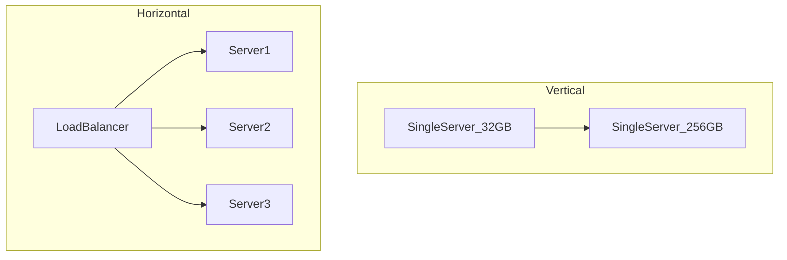

# Performance vs Scalability

## What is it, in one line?

**Performance** is how fast the system is for a given load; **scalability** is whether adding resources lets you handle **more** load without falling over.

---

## Why it exists

Teams often confuse “make it faster on my laptop” with “handle Black Friday.” They require different fixes:

- **Performance problem:** One user waits 5 seconds for a search—optimize code, indexes, algorithm.
- **Scalability problem:** One user waits 200 ms, but at 50k concurrent users everyone waits 30 seconds—add capacity, distribution, caching.

---

## Definitions (Primer-aligned)

A service is **scalable** if increased resources produce increased capability **proportionally**—more servers → more requests handled, or more data stored with acceptable speed.

| Symptom | Likely issue |
|---------|----------------|
| Slow with **one** user | Performance (hot path, N+1 queries, missing index) |
| Fast alone, slow at **peak** | Scalability (saturation, locks, single bottleneck) |

---

## Vertical vs horizontal scaling

| | Vertical scaling (“scale up”) | Horizontal scaling (“scale out”) |
|--|-------------------------------|----------------------------------|
| **Action** | Bigger CPU/RAM/disk on one machine | More machines |
| **Limit** | Hardware ceiling, cost curve | Complexity, state, data sync |
| **Example** | 64 GB → 256 GB RAM on DB server | 10 stateless API pods behind LB |

**Real-world:** Instagram scaled out application tiers horizontally while evolving database sharding; early days also scaled up monolith DB until sharding was mandatory.

---

## Performance tactics (single-node or small scale)

- Better algorithms (O(n log n) vs O(n²))
- Database indexes, query tuning
- Avoid unnecessary network hops
- Profile CPU/memory (fix hot loops)

## Scalability tactics (growth)

- **Stateless** app tier + load balancer
- **Caching** read-heavy data
- **Replication** and **sharding** for databases
- **Async** work off critical path
- **CDN** for static/geographic distribution

Harvard scalability lecture (referenced in the Primer) groups: vertical/horizontal scaling, caching, load balancing, DB replication, partitioning—Weeks 2–4 cover these in detail.

---

## Real-world example: Amazon product page

- **Performance:** Render page in <200 ms via optimized templates and service calls.
- **Scalability:** During Prime Day, **auto-scale** thousands of web servers; product data served from caches and regional services; cart/checkout isolated so browsing stays up.

Fixing a slow SQL query helps **performance**. Adding 500 web servers helps **scalability**—both may be needed.

---

## Trade-offs

- Horizontal scaling adds **operational complexity** (deployments, observability, consistency).
- Vertical scaling is **simple** until it isn’t—one big DB is a single point of failure and scale ceiling.
- Over-optimizing performance before product-market fit wastes time; ignoring scalability before launch can cause outages at first viral spike.

---

## Interview questions

- “Is this a performance or scalability issue?” — Ask about **one user vs many**.
- “How would you scale this component?” — Name bottleneck, then LB/cache/shard/async.
- “Why not one very large server?” — Cost, failure domain, upper hardware limit.

---

## Recap

- Performance = speed at current load; scalability = growth with resources.
- Scale **up** vs **out**—modern web systems favor **out** for app tier.
- Match diagnosis to fix: optimize hot path **or** distribute load.
- Next: [1.2-latency-vs-throughput.md](1.2-latency-vs-throughput.md)
