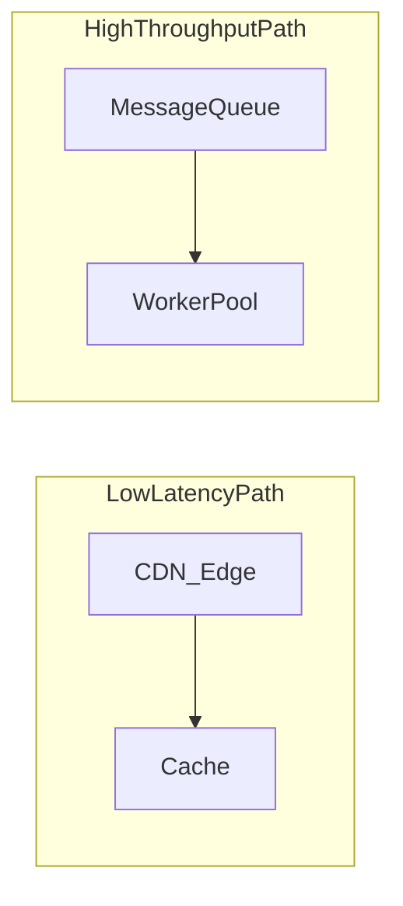

# Latency vs Throughput

## What is it, in one line?

**Latency** is how long **one** operation takes; **throughput** is how **many** operations complete per unit time.

---

## Why it exists

Product and engineering goals pull in different directions:

- Users feel **latency** (“why is my feed slow?”).
- Business measures **throughput** (“how many orders per second can we take?”).

Good systems target **high throughput** at **acceptable latency**—not always minimum possible latency.

---

## Analogies

| Domain | Latency | Throughput |
|--------|---------|------------|
| Highway | Time for **one car** city A → B | **Cars per hour** on the road |
| Coffee shop | Wait time for **your** latte | **Lattes per hour** the baristas make |
| API | p99 response time for one request | Requests/sec the cluster sustains |

---

## Relationship (not always inverse)

Sometimes optimizations **improve both** (better index → faster queries → more QPS).

Sometimes they **trade off**:

- **Batching** increases throughput (process 1000 records per job) but increases latency for each record until batch runs.
- **Strong sync replication** may add latency per write while keeping throughput stable on reads.

---

## Percentiles matter

Average latency hides outliers. Production SLOs often use:

- **p50** (median)—typical experience
- **p95 / p99**—tail latency (“slow for 1% of users”)

**Real-world:** Google and Amazon publish that **tail latency** drives user satisfaction; optimizing p99 often matters more than shaving p50.

---

## Real-world example: YouTube video start

- **Latency-sensitive:** Time until playback starts (buffer first seconds)—users abandon if >2–3 seconds feels broken.
- **Throughput-sensitive:** Encoding farm must process **hours of upload per minute** globally—batch transcode pipelines maximize **videos processed per hour**, possibly at cost of **when** 4K rendition becomes available (minutes later).

Different subsystems optimize different metrics.

---

## Design patterns by goal

| Goal | Patterns |
|------|----------|
| Lower latency | Edge CDN, geographic routing, caching, connection pooling, avoid chatty RPC chains |
| Higher throughput | Horizontal scale, async queues, batch writes, partition work (Kafka partitions) |

---

## Interview questions

- “How do you improve throughput without killing latency?” — Cache reads, async non-critical work, scale out stateless tier.
- “What metric would you SLO for checkout vs analytics?” — Checkout: strict p99 latency; analytics: throughput and freshness hours later OK.

---

## Recap

- Latency = time per operation; throughput = operations per second.
- Aim for **max throughput at acceptable latency**; use percentiles in production.
- Batching and async help throughput; edge/cache help latency.
- Next: [1.3-cap-availability-vs-consistency.md](1.3-cap-availability-vs-consistency.md)
