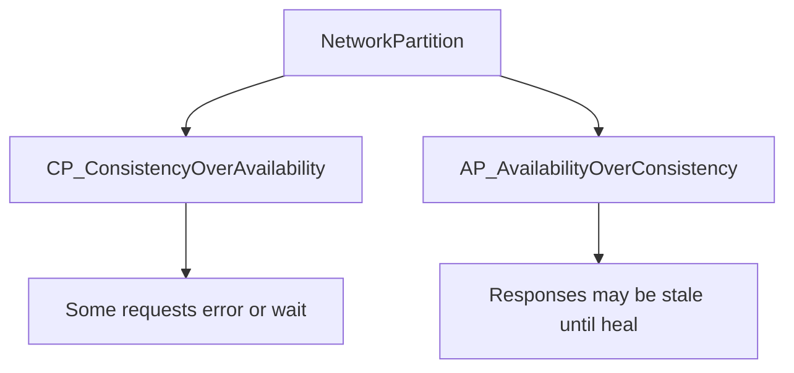

# CAP Theorem: Availability vs Consistency

## What is it, in one line?

In a **distributed** system during a **network partition**, you cannot have both perfect **consistency** and perfect **availability**—you must choose (partition tolerance is non-optional in real networks).

---

## Why it exists

Data is copied to multiple machines for reliability and scale. When networks fail, copies **diverge**. CAP forces you to decide what the product promises during that failure.

---

## CAP definitions (Primer)

| Property | Meaning |
|----------|---------|
| **Consistency (C)** | Every read gets the **latest write** or an error |
| **Availability (A)** | Every request gets a **response** (not necessarily latest data) |
| **Partition tolerance (P)** | System keeps working despite **network splits** between nodes |

**Real networks partition** (switch misconfig, cable cut, AZ outage). So **P is required** for distributed systems.

During a partition, you choose **CP** or **AP**:

---

## CP (Consistency + Partition tolerance)

- Coordinator may **block** or **error** if it cannot reach a quorum for latest write.
- **Use when:** Financial balances, inventory that must not oversell, leader election.

**Real-world:** ZooKeeper / etcd used for **strong consistency** metadata (who is leader, config)—clients may wait or fail during partition rather than see wrong leader.

---

## AP (Availability + Partition tolerance)

- Every node **responds** with **best available** data; writes propagate **eventually**.
- **Use when:** Social likes, view counts, DNS, shopping cart UI that merges later.

**Real-world:** Amazon Dynamo-style systems (AP) for shopping cart—availability during partitions; conflicts resolved with merge rules.

---

## Common misunderstanding

CAP is about **behavior during partition**, not “SQL vs NoSQL.” You can tune consistency per operation (e.g. quorum reads in Cassandra).

Also: **ACID** (single DB) vs **CAP** (distributed)—different layers. Sharded SQL with sync replication behaves CP-ish on writes; async replicas add eventual consistency on reads.

---

## PACELC extension (interview bonus)

If **no partition**, you still trade **latency (L)** vs **consistency (C)**. Many systems choose **eventual consistency** even when network is fine, to reduce latency.

---

## Real-world example: Bank transfer vs Instagram like

| Feature | Typical choice | Why |
|---------|----------------|-----|
| Transfer between accounts | **Strong consistency / CP** | Must not double-spend or lose money |
| Like count on a reel | **Eventual consistency / AP** | Showing 1,042 vs 1,045 likes for seconds is OK |

---

## Interview questions

- “CP or AP for a ticket inventory system?” — **CP** (or strong linearizable writes) to avoid overselling; may return errors under partition.
- “What happens during partition in AP system?” — Writes accepted locally; **conflict resolution** on heal (LWW, vector clocks, CRDTs—depth as needed).

---

## Recap

- Partitions happen; pick **CP** (correct or error) vs **AP** (always respond, may be stale).
- Match choice to **business** impact of stale data.
- Next: [1.4-consistency-patterns.md](1.4-consistency-patterns.md)
