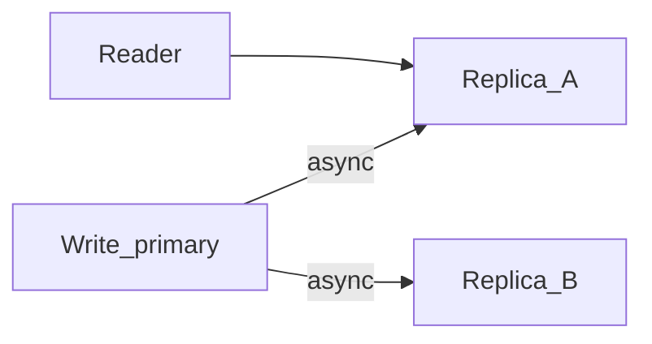

# Consistency Patterns

## What is it, in one line?

**Consistency patterns** describe how soon all copies of data show the same value after a write—from “maybe never immediately” to “always immediately.”

---

## Why it exists

Replication makes systems fast and available, but copies lag. Product and legal requirements decide how much lag is acceptable.

CAP (Week 1.3) is about **partition** behavior; these patterns describe **normal** replication behavior too.

---

## Primer’s three levels

### Weak consistency

After a write, reads **may or may not** see it—no guarantee when.

- **Best-effort** sync.
- **Real-world:** In-memory caches without strict invalidation; some realtime games/voice where lost packets are not replayed (you don’t hear what was said during dead air).

### Eventual consistency

After a write, reads **will** see it **after some delay** (often milliseconds to seconds).

- **Async replication** between nodes.
- **Real-world:** **DNS** TTL propagation; **email** delivery; **S3** cross-region replication; social **follower counts**.

### Strong consistency

After a write, **all** reads see it (linearizable or equivalent for the model).

- Often **synchronous** replication or single leader + quorum reads.
- **Real-world:** **Bank ledger** on one primary DB with read-from-primary for balance; **POSIX file** semantics on local FS.

---

## Comparison table

| Pattern | Staleness | Availability under lag | Example use |
|---------|-----------|------------------------|-------------|
| Weak | Unbounded | High | Ephemeral realtime state |
| Eventual | Bounded, fades to zero | High | DNS, feeds, analytics |
| Strong | None | May block/error if sync fails | Money, inventory locks |

---

## Read-your-writes (common product requirement)

User expects to see **their own** update immediately even if others see stale data briefly.

**Implementation:** Route that user’s reads to primary, or sticky session to replica that has caught up, or client version tokens.

**Real-world:** Facebook posting a status—you see it instantly on your profile; friends may see it a second later.

---

## Monotonic reads

User should not see time **go backward** (read v2 then v1).

**Fix:** Per-user sticky replica or version checks.

---

## Real-world example: Uber surge pricing

- Surge multiplier must be **consistent enough** in a region to avoid unfair charges—often **stronger consistency** on pricing service for a geo cell.
- Driver location updates are **high volume** and **eventually consistent** on map display (nearby cars move smoothly with frequent updates, not strict global order).

Same company, **different consistency** per feature.

---

## Trade-offs

- Stronger consistency → higher **latency**, lower **availability** during failures.
- Eventual → simpler scaling, risk of **conflicts** and user confusion if UI doesn’t explain delay.

---

## Interview questions

- “Which consistency for notification badge count?” — Often eventual; badge off by few is OK.
- “How do you implement eventual consistency?” — Primary + async replicas; cache TTL; message queue for index updates.

---

## Recap

- **Weak / eventual / strong** — how quickly replicas align.
- Product picks per feature, not one global rule.
- **Read-your-writes** is a frequent middle ground.
- Next: [1.5-availability-patterns.md](1.5-availability-patterns.md)
