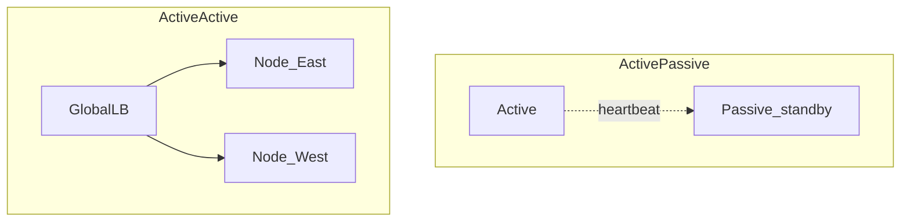

# Availability Patterns

## What is it, in one line?

**Availability patterns** keep service running when components fail—through **failover**, **replication**, and redundancy math (“nines”).

---

## Why it exists

Hardware, software, and humans fail. Availability patterns convert “single server” designs into “survives one failure” designs—at cost of complexity and money.

---

## Failover

### Active-passive

- **Active** server handles traffic; **passive** standby receives heartbeats.
- On failure, passive takes **VIP/IP** or DNS switch and resumes.
- **Cold standby:** passive starts from scratch → longer downtime.
- **Hot standby:** passive already running, synced → seconds of downtime.

Also called **master-slave failover** (database context).

**Real-world:** Traditional MySQL primary + standby replica; promotion on primary death (with risk of lost un-replicated writes).

### Active-active

- **Both** nodes serve traffic; load shared.
- Requires **shared or partitioned data** strategy and conflict handling for writes.
- **Master-master** replication is a database variant.

**Real-world:** Multi-region active-active front doors (Global Accelerator, Anycast) sending users to nearest healthy POP.



### Failover disadvantages (Primer)

- Extra hardware and **complexity**
- Possible **data loss** if active fails before replicating latest writes
- Split-brain if heartbeats wrong—need fencing / quorum

---

## Replication (data availability)

Replication copies data so reads (and sometimes writes) survive node loss.

- **Master-slave:** one writer, many readers (Week 3).
- **Master-master:** multiple writers—conflicts possible.

Failover **uses** replication; replication alone doesn’t switch traffic—you need orchestration (Patroni, RDS failover, K8s health checks).

---

## Availability in numbers (“nines”)

| Availability | Downtime / year (approx.) |
|--------------|---------------------------|
| 99.9% (3 nines) | 8h 46m |
| 99.99% (4 nines) | 52m |
| 99.999% (5 nines) | 5.3m |

**Primer tables** also break down per month/week/day—useful for SLA discussions.

---

## Serial vs parallel availability

**Components in series** (request must pass A **and** B):

```
Availability_total ≈ Av(A) × Av(B)
```

If each is 99.9%, total ≈ **99.8%**—chain is **weaker**.

**Components in parallel** (either A **or** B can serve):

```
Availability_total ≈ 1 - (1 - Av(A)) × (1 - Av(B))
```

Two 99.9% parallel paths → **99.9999%**—redundancy **helps**.

**Interview tip:** Adding more **mandatory** dependencies in series **hurts** SLA; redundant parallel paths **help**.

---

## Real-world example: AWS Availability Zones

- Deploy **multi-AZ**: LB → app in AZ-a and AZ-b → RDS Multi-AZ primary + standby.
- Survives **single AZ** failure; not full region loss (need multi-region for that).

Netflix **Chaos Monkey** randomly kills instances to force teams to design for failure—availability as culture, not only architecture.

---

## Health checks and load balancers

LB sends traffic only to **healthy** backends (HTTP `/health`, TCP check).

Without health checks, users hit dead servers → perceived **outage** even if some nodes OK.

---

## Trade-offs

- Active-active is **harder** for strongly consistent writes.
- More nines → **exponential cost** (multi-region, dedicated failover automation).
- 100% is impossible—define **acceptable downtime** with product.

---

## Interview questions

- “How do you achieve 4 nines?” — Remove SPOF, multi-AZ, automated failover, monitoring, runbooks; quantify weak links in series.
- “Active-active or active-passive for DB?” — Often active-passive for single-primary SQL; active-active needs conflict strategy.

---

## Recap

- **Failover:** active-passive vs active-active.
- **Replication** enables recovery; watch data loss window.
- **Multiply** availability for series; **combine** for parallel redundancy.
- Next: [1.6-practice-problems.md](1.6-practice-problems.md)
