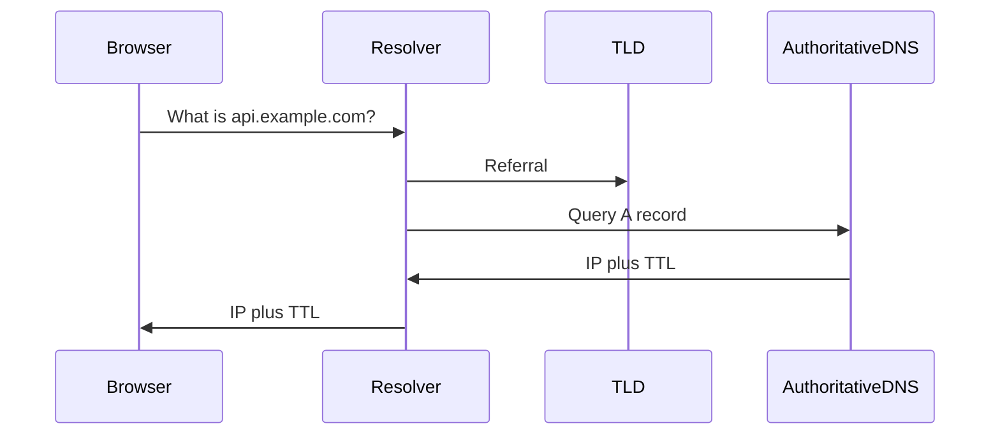

# Domain Name System (DNS)

## What is it, in one line?

**DNS** translates human-readable names (`www.netflix.com`) into **IP addresses** computers use to connect.

---

## Why it exists

Users remember names; networks route by IP. DNS is the global phone book—hierarchical, cached, and eventually consistent.

---

## How a lookup works (simplified)

1. Browser checks **OS/browser cache**.
2. If miss, query **recursive resolver** (ISP or 8.8.8.8).
3. Resolver walks hierarchy: root → TLD (`.com`) → authoritative name server for `netflix.com`.
4. Answer returned with **TTL** (time to live)—how long to cache.

---

## Common record types (Primer)

| Record | Purpose |
|--------|---------|
| **A** | Name → IPv4 address |
| **AAAA** | Name → IPv6 |
| **CNAME** | Alias → another name |
| **MX** | Mail server for domain |
| **NS** | Which servers are authoritative |

---

## DNS as a routing lever

Managed DNS (Route 53, Cloudflare) can route by:

- **Weighted round robin** — A/B tests, drain servers for maintenance
- **Latency-based** — send user to fastest region
- **Geolocation** — EU users to EU endpoints

**Real-world:** During blue/green deploy, weights shift traffic from old to new stack without users changing URLs.

---

## Caching and staleness

DNS is **eventually consistent**. After you change an IP, old caches until **TTL expires**—plan lower TTL before migrations (e.g. 60s), then raise again.

**Disadvantage (Primer):** Extra latency on cache miss; DDoS on DNS can block access even if your app is healthy—know IP bypass for break-glass ops only.

---

## Real-world example: Twitter outage lesson

If users only know `twitter.com` and DNS is attacked or misconfigured, the site feels “down” even when servers run. Large sites use **multiple DNS providers** and anycast for resiliency.

---

## Interview questions

- “User cannot reach site—debug steps?” — DNS resolution, TTL, wrong A record, local cache.
- “How roll out new cluster?” — Lower TTL, update records, weighted routing.

---

## Recap

- DNS: name → IP; hierarchical; cached with TTL.
- Can **route traffic**, not just resolve.
- Eventual consistency affects cutovers.
- Next: [2.2-cdn.md](2.2-cdn.md)
