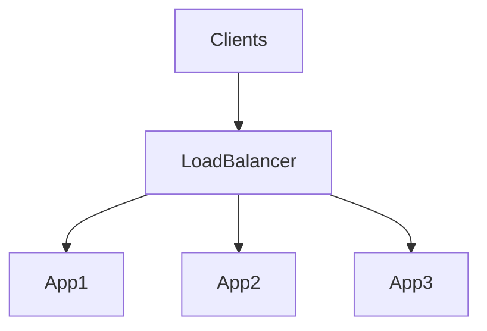

# Load Balancer

## What is it, in one line?

A **load balancer** distributes incoming requests across **multiple backend servers** so no single machine carries all traffic.

---

## Why it exists

One server has a CPU/network ceiling. Load balancers:

- Spread load (**horizontal scaling**)
- Skip **unhealthy** backends
- Reduce **single point of failure** (when deployed redundantly)

**Real-world:** AWS Application Load Balancer (ALB) in front of ECS/Kubernetes pods; Google Cloud Load Balancing globally.

---

## What a load balancer does (Primer)

- Routes client request → chosen server
- Returns server response → client
- Optional: **SSL/TLS termination** (decrypt at LB, HTTP inside VPC)
- Optional: **session persistence** (sticky cookie to same instance)

---

## Layer 4 vs Layer 7

| | **Layer 4 (L4)** | **Layer 7 (L7)** |
|--|------------------|------------------|
| **Sees** | IP, port, TCP/UDP | HTTP headers, URL path, cookies |
| **Routing** | Fast, less context | Route `/video` to video cluster, `/billing` to PCI cluster |
| **Example** | NLB, HAProxy TCP mode | ALB, NGINX HTTP |

L7 terminates connections and can inspect messages—more flexible, slightly more CPU.

---

## Routing algorithms

- Round robin / **weighted** round robin
- **Least connections** / least loaded
- **Random**
- **Hash** on client IP or session id (sticky)

**Real-world:** Weighted routing drains a bad deployment: set new version weight 0, old 100, then shift.

---

## Horizontal scaling requirements (Primer)

App servers should be **stateless**:

- No local session files—store sessions in **Redis** or DB
- Uploads to **object storage**, not local disk

Scaling out increases connections to **DB and cache**—plan pool sizes.

---

## Redundant load balancers

One LB is a SPOF. Run **active-passive** or **active-active** pair (often with floating IP or DNS failover).

**Disadvantages:** Cost, complexity, misconfigured LB becomes **performance bottleneck**.

---

## Diagram

---

## Interview questions

- “L4 vs L7 for WebSocket API?” — Often L7 or dedicated gateway; need connection awareness.
- “How handle sticky sessions?” — Cookie-based stickiness vs external session store (prefer external for scale).

---

## Recap

- LB = distribute + health check + optional TLS offload.
- **L4** fast; **L7** smart routing.
- Stateless apps scale horizontally behind LB.
- Next: [2.4-reverse-proxy.md](2.4-reverse-proxy.md)
