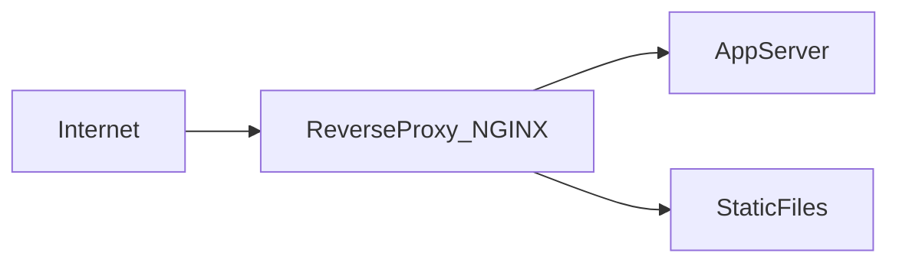

# Reverse Proxy (Web Server)

## What is it, in one line?

A **reverse proxy** sits in front of internal services as the **public face**—clients talk to it, and it forwards requests to the right backend.

---

## Why it exists

Even with **one** app server, a reverse proxy adds:

- **Security** — hide internal topology, IP allow/deny, rate limits
- **TLS termination** — one place for certificates
- **Compression** — gzip/brotli responses
- **Caching** — return cached responses without hitting app
- **Static files** — serve CSS/JS/images directly

**Real-world:** NGINX in front of Node/Python apps; Cloudflare as reverse proxy + WAF at the edge.

---

## Reverse proxy vs load balancer (Primer)

| | **Load balancer** | **Reverse proxy** |
|--|-------------------|-------------------|
| **Typical use** | **Many** identical backends | **One or many**; unified gateway |
| **When** | Scale identical app tier | Security, caching, routing, even single server |

**NGINX / HAProxy** can do **both** L7 reverse proxy and load balancing.

---

## Common features in production

- **Path routing:** `/api/*` → API cluster, `/` → web app
- **WebSocket upgrade** handling
- **Request buffering** for slow clients
- **Access logs** and metrics at edge

---

## Disadvantages (Primer)

- Another component to **operate** and patch
- SPOF unless **paired** failover
- Misconfiguration can **drop** headers needed by app (X-Forwarded-For, Host)

---

## Real-world example: Pinterest early architecture

Public traffic hit NGINX for SSL and static assets; dynamic requests proxied to application workers—clean separation before full microservices maturity.

---

## Interview questions

- “Why not expose app servers directly?” — TLS ops, DDoS surface, no central caching/compression.
- “Difference from forward proxy?” — Forward proxy (corporate proxy) hides **clients** from internet; reverse hides **servers**.

---

## Recap

- Reverse proxy = public gateway with security, TLS, cache, static.
- Complements LB; same tools often do both.
- Next: [2.5-application-layer-microservices.md](2.5-application-layer-microservices.md)
