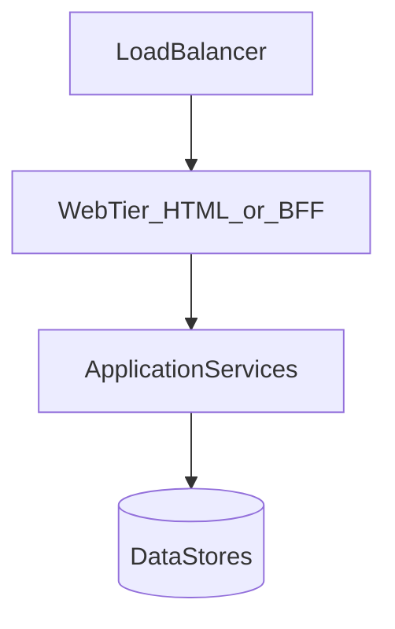

# Application Layer, Microservices, and Service Discovery

## What is it, in one line?

The **application layer** runs your business logic (APIs, workers); **microservices** split that logic into small deployable services; **service discovery** helps them find each other.

---

## Why it exists

**Monolith:** one deploy unit—simple early, painful later (long builds, all-or-nothing scale).

**Separated web vs app layer (Primer):** Scale UI servers separately from API servers. Add new API endpoints without adding web servers.

**Microservices:** Each service owns one business capability—deploy and scale independently.

**Real-world (Primer):** Pinterest might split user profile, followers, feed, search, photo upload into separate services.

---

## Web layer vs application layer

**BFF (Backend for Frontend):** Mobile app talks to mobile BFF that aggregates microservices—reduces chatty clients.

---

## Microservices characteristics

- **Independently deployable**
- **Own data** (ideally)—no shared DB anti-pattern across many teams
- Communicate via **HTTP/gRPC** or **async messages**
- **Small teams** own services (two-pizza rule)

**Workers** in app layer enable **async** jobs (Week 4)—video transcode, email, index update.

---

## Service discovery

Services register **name → address:port**; callers ask registry instead of hardcoding IPs.

| Tool | Notes |
|------|-------|
| **Consul** | Health checks, KV config |
| **etcd** | Kubernetes backing store |
| **Zookeeper** | Older, still in Hadoop/Kafka ecosystems |
| **Kubernetes DNS** | `http://payments.default.svc.cluster.local` |

Health checks (HTTP `/health`) remove bad instances from rotation.

---

## Disadvantages (Primer)

- **Operational overhead** — many deployables, logs, traces
- **Distributed debugging** — need correlation IDs
- **Data consistency** across services harder than one DB transaction
- **Network latency** between services

Start monolith/modular monolith; extract services when **clear boundaries** hurt (scale, team, release cadence).

---

## Real-world example: Uber

Separate services for trips, pricing, maps, payments—trip flow orchestrates RPC calls; outages isolated (maps degraded vs payments down).

---

## Interview questions

- “Monolith or microservices for startup?” — Monolith until pain; mention **modular** boundaries for future split.
- “How does service A find B?” — Discovery registry, DNS, service mesh (Istio) for advanced traffic policy.

---

## Recap

- App layer = business logic + workers.
- Microservices = independent services with trade-offs.
- Service discovery + health checks for dynamic IPs.
- Next: [2.6-practice-problems.md](2.6-practice-problems.md)
