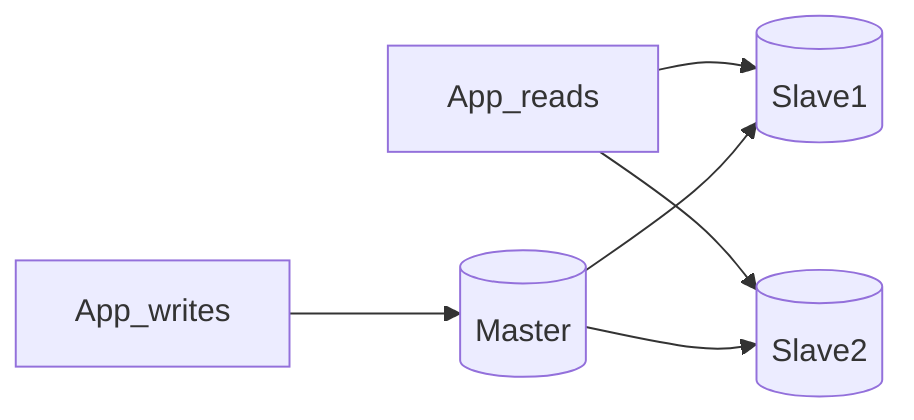

# RDBMS and Scaling Relational Databases

## What is it, in one line?

An **RDBMS** stores data in **tables** with relationships and **ACID transactions**; scaling uses replication, splitting, denormalization, and query tuning.

---

## Why it exists

Money, inventory, and accounts need **strong guarantees**. SQL databases (PostgreSQL, MySQL) are the default for structured, relational data with complex queries.

---

## ACID (Primer)

| Property | Meaning |
|----------|---------|
| **Atomicity** | Transaction all succeeds or all rolls back |
| **Consistency** | Valid state before and after |
| **Isolation** | Concurrent txs behave like serial |
| **Durability** | Committed data survives crash |

**Real-world:** Stripe payment intent + charge in one transaction—no half-applied payment.

---

## Master-slave replication

- **Master:** reads + writes; replicates to **slaves**
- **Slaves:** reads only (typically)
- Master failure → promote slave or provision new master (manual/automated)

**Pros:** Read scaling, backups from slave.  
**Cons:** Replication lag → stale reads; failover complexity; write still single bottleneck.

---

## Master-master replication

Both nodes read/write; must resolve **conflicts**.

**Pros:** Continues writes if one master down.  
**Cons:** Conflict resolution, latency on sync, not true ACID across both without careful design.

---

## Federation (functional partitioning)

Split by **business area** into separate DBs: `users_db`, `products_db`, `orders_db`.

**Pros:** Smaller DBs, less coupling load, parallel writes across domains.  
**Cons:** No cross-DB joins in one query; app routes reads/writes; more ops overhead.

**Real-world:** Early scaling pattern before sharding one giant users table.

---

## Sharding (horizontal partition)

Split **rows** of one logical table across shards by key (e.g. `user_id % N`, geographic shard, consistent hashing).

**Pros:** Write scale, smaller indexes, blast radius if one shard fails (with replication).  
**Cons:** Rebalancing hot shards; cross-shard queries hard; app must route.

**Real-world:** Instagram/Facebook sharded user data; Vitess helps MySQL sharding.

---

## Denormalization

Duplicate columns to **avoid expensive joins** on read (e.g. store `author_name` on each comment).

**Pros:** Faster reads (often 100:1 read:write).  
**Cons:** Duplicate data; sync on update; write complexity.

Works with materialized views in PostgreSQL/Oracle.

---

## SQL tuning (Primer highlights)

1. **Benchmark & profile** — `EXPLAIN`, slow query log, load tests.
2. **Schema** — right types; indexes on WHERE/JOIN/ORDER BY; avoid huge BLOBs in row.
3. **Indexes** — B-tree speed vs slower writes and RAM.
4. **Avoid heavy joins** — denormalize when needed.
5. **Partition hot tables** — keep hot subset in memory.

**Real-world:** Amazon order history—indexes on `(user_id, created_at)` for “my orders” page.

---

## Replication disadvantages (shared)

- Data loss window if master dies before replicate
- Many slaves → **replication lag**
- More hardware and failure modes

---

## Interview questions

- “Read-heavy product catalog?” — Replicas + cache + CDN for images.
- “Write-heavy chat?” — Shard by conversation_id or user; consider NoSQL (Week 3.2).

---

## Recap

- SQL = ACID, relations, complex queries.
- Scale: **replication**, **federation**, **sharding**, **denormalization**, **tuning**.
- Each adds app routing or consistency trade-offs.
- Next: [3.2-nosql.md](3.2-nosql.md)
