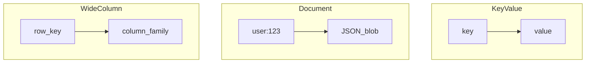

# NoSQL Database Types

## What is it, in one line?

**NoSQL** databases trade strict relational ACID (often) for **flexible schemas**, **massive scale**, and models matched to access patterns—key-value, document, wide-column, graph.

---

## Why it exists

At TB/PB scale and extreme IOPS, one normalized SQL cluster may be wrong tool. NoSQL aligns storage shape with **how you read/write** (partition key, document id, etc.).

**BASE** (vs ACID) — Primer:

- **Basically available**
- **Soft state**
- **Eventual consistency**

Often **AP** in CAP terms.

---

## Key-value store

**Abstraction:** giant hash map — `get(key)`, `put(key, value)`.

- O(1) lookups; in-memory or SSD (Redis, DynamoDB as KV)
- **Use:** sessions, cache, feature flags, rate limit counters

**Real-world:** Redis stores session tokens for millions of logged-in users.

**Limit:** no complex query—logic in app.

---

## Document store

**Abstraction:** key → JSON/XML **document** (whole object).

- MongoDB, CouchDB; DynamoDB also document mode
- Query inside document fields; flexible schema per document

**Use:** catalogs, user profiles, content with varying fields

**Real-world:** MongoDB for product catalogs where attributes differ per category (electronics vs clothing).

---

## Wide-column store

**Abstraction:** rows keyed by **row key**; many **columns** grouped in **column families**.

- Cassandra, HBase, Bigtable heritage
- Optimized for **partition key** access and huge scale
- Timestamps for versioning/conflict resolution

**Use:** time-series, messaging metadata, analytics at scale

**Real-world:** Cassandra at Apple, Netflix for high-write durable storage.

---

## Graph database

**Abstraction:** **nodes** and **edges** (relationships).

- Neo4j, etc.
- Fast traversals: friends-of-friends, recommendations, fraud rings

**Use:** social graph queries, knowledge graphs

**Real-world:** LinkedIn-style “people you may know” — graph traversals expensive in SQL at depth.

**Cons:** Less mature tooling; often REST/gremlin APIs; not for every workload.

---

## When NoSQL shines (Primer samples)

- Clickstream / logs ingest
- Leaderboards
- Shopping cart (ephemeral)
- Hot tables / high IOPS
- Metadata at huge scale

---

## Interview questions

- “Design session store?” — Redis KV with TTL.
- “Billions of sensor readings?” — Wide-column or time-series DB, partition by device_id + time.

---

## Recap

- Four families: **KV, document, wide-column, graph**.
- Pick by **access pattern**, not hype.
- Expect **eventual consistency** and app-side joins.
- Next: [3.3-sql-vs-nosql.md](3.3-sql-vs-nosql.md)
