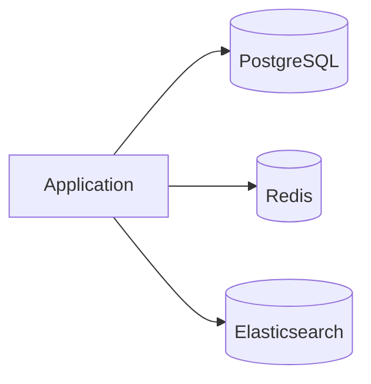

# SQL vs NoSQL — How to Choose

## What is it, in one line?

A decision framework: use **SQL** when you need strong relations and transactions; use **NoSQL** when scale, schema flexibility, or access pattern favors specialized stores.

---

## Why it exists

“NoSQL vs SQL” debates miss the point—**both** appear in real systems (Polyglot persistence).

---

## Reasons for SQL (Primer)

- Structured data with **strict schema**
- **Relational** data and **complex joins**
- **ACID transactions** (payments, inventory)
- Mature **tools**, ORMs, hiring pool
- Fast **indexed lookups** on known patterns

**Real-world:** PostgreSQL for orders, accounts, subscriptions at Shopify-scale (with scaling patterns from 3.1).

---

## Reasons for NoSQL (Primer)

- Semi-structured / **evolving schema**
- **No** heavy cross-entity joins in hot path
- **Very large** data (TB–PB)
- Extreme **write/read IOPS**
- Simple access pattern (key → blob)

**Real-world:** DynamoDB for Amazon shopping cart; Elasticsearch for search indexes.

---

## Polyglot persistence pattern

One product, multiple stores:

| Data | Store | Why |
|------|-------|-----|
| Orders | PostgreSQL | ACID |
| Sessions | Redis | Speed, TTL |
| Product search | Elasticsearch | Full-text |
| Activity log | Cassandra | Write volume |

---

## Migration path (Primer theme)

Many teams: **SQL first** → extract hot paths to cache/NoSQL when metrics prove need.

Avoid premature sharding—operational cost is real.

---

## Common interview mistakes

- “Always microservices + Cassandra” for 1000 users
- “SQL cannot scale” — Instagram started on PostgreSQL; scale patterns exist
- Ignoring **operational** cost of multi-store consistency

---

## Decision checklist

1. Need multi-row **transaction**? → SQL (or careful distributed tx).
2. Access always by **one key**? → KV/document candidate.
3. **Graph** hops? → Graph DB or precomputed in SQL with limits.
4. **Search** full text? → Search engine, not primary SQL.
5. Team and **timeline**? → Simpler stack until proven otherwise.

---

## Real-world example: Uber

Relational stores for billing; Cassandra for some high-volume locations; Redis for caching—choice per access pattern and SLO.

---

## Recap

- SQL: relations, transactions, clarity.
- NoSQL: scale, flexibility, pattern-specific.
- Production = **often both**; justify each store.
- Next: [3.4-practice-problems.md](3.4-practice-problems.md)
