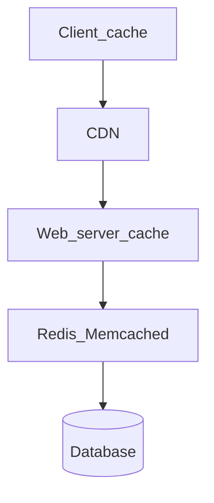

# Caching Levels

## What is it, in one line?

**Caching** stores copies of expensive data closer to where it’s needed so reads are faster and backends survive traffic spikes.

---

## Why it exists

Databases and cross-network calls are slow compared to RAM. Popular keys skew load—**celebrity tweet**, **viral product**—caches absorb uneven demand (Primer).

---

## Cache layers (Primer)

| Layer | Where | Example |
|-------|-------|---------|
| **Client** | Browser/OS | Cache-Control, local storage (careful with secrets) |
| **CDN** | Edge POP | Static assets |
| **Web server** | NGINX/Varnish | Full page or API response cache |
| **Application** | Redis/Memcached | Object/session cache |
| **Database** | Buffer pool, query cache | Engine-level (tune carefully) |

---

## What to cache

- **Sessions** — fast auth without DB hit every request
- **Hot DB rows** — user profile, product by id
- **Query results** — hash of SQL → result set (invalidation hard)
- **Objects** — assembled domain object (preferred over raw query cache)
- **Rendered HTML** — very effective for public pages

Avoid **file-based** cache on servers you auto-scale—hard to share across instances.

---

## Query-level vs object-level (Primer)

**Query cache:** Key = hash(query). Problem: one cell change invalidates many query keys.

**Object cache:** Key = `user:123`. Invalidate when user 123 updates—clearer ownership.

**Real-world:** Facebook memcached stores precomputed graph slices and objects, not arbitrary SQL strings.

---

## Hot keys and thundering herd

**Hot key:** millions read same cache key—single Redis node saturates.

**Mitigations:** local in-process cache, replicate hot key, random TTL jitter, request coalescing (single flight).

**Cache miss storm:** key expires; 1000 threads hit DB—**stampede**. Mitigate: lock on rebuild, early refresh (Week 4.2).

---

## Redis vs Memcached (Primer notes)

- **Memcached:** simple cache-aside, LRU
- **Redis:** structures (sorted sets for leaderboards), optional persistence

---

## Disadvantages (Primer)

- **Invalidation** is hard—“two hard problems in CS”
- Consistency with DB
- Another system to operate

---

## Real-world example: Amazon product page

CDN for images; edge cache for semi-static fragments; Redis for session and cart; DB for source of truth on inventory (not only cache).

---

## Recap

- Stack caches from client → CDN → app → DB.
- Prefer **object** caching over query caching when possible.
- Plan hot keys and stampedes.
- Next: [4.2-cache-update-strategies.md](4.2-cache-update-strategies.md)
