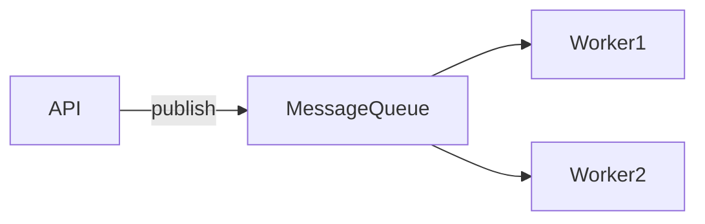

# Asynchronism: Message Queues, Task Queues, Back Pressure

## What is it, in one line?

**Asynchronism** moves slow work off the user’s request path using **queues** and **background workers**, improving latency and resilience.

---

## Why it exists

Some operations take seconds (send email, transcode video, rebuild search index). Doing them **inline** blocks HTTP and risks timeouts.

**Primer:** Also **precompute** work (nightly aggregates) via async pipelines.

---

## Message queues

**Pattern:**

1. API publishes **job message** to queue
2. Returns quickly (“accepted”)
3. **Worker** consumes, processes, acks

**User experience:** Tweet appears on **your** timeline fast; fan-out to followers happens async (Twitter model).

| System | Notes |
|--------|-------|
| **Redis lists/streams** | Simple; can lose messages if not careful |
| **RabbitMQ** | AMQP, routing, at-least-once |
| **Kafka** | Log, replay, high throughput |
| **Amazon SQS** | Managed; at-least-once, visibility timeout |

**Real-world:** Uber trip events → analytics, billing, notifications via Kafka.

---

## Task queues

Focused on **running tasks** with results (often scheduled).

- **Celery** (Python) + Redis/RabbitMQ backend
- Cron-style periodic jobs (reports, cleanup)

Difference from generic MQ: task framework includes retry, result backend, scheduling.

---

## Back pressure (Primer)

If producers outpace consumers, queue grows → memory/disk pressure → slowdown everywhere.

**Response:** Cap queue size; reject with **503 Server Busy**; client **retries with backoff**.

Protects system under overload vs unbounded latency growth.

**Real-world:** Load shedding during viral events—degrade non-critical features first.

---

## When NOT to async

- Cheap, **realtime** operations needing immediate consistency
- Adds **complexity** (duplicate messages, ordering, idempotency)

Workers must handle **at-least-once delivery** — same job twice should be safe (**idempotent** consumers).

---

## Idempotency example

Payment charge with **idempotency key** header—retry does not double charge.

Email send: dedupe by `(user_id, campaign_id)` in worker.

---

## Disadvantages (Primer)

- Delay before work completes
- Debugging distributed flows harder—need **tracing** (OpenTelemetry)

---

## Recap

- MQ decouples API from slow workers.
- Task queues add scheduling and task lifecycle.
- **Back pressure** prevents overload death spiral.
- Design **idempotent** consumers.
- Next: [4.4-practice-problems.md](4.4-practice-problems.md)
