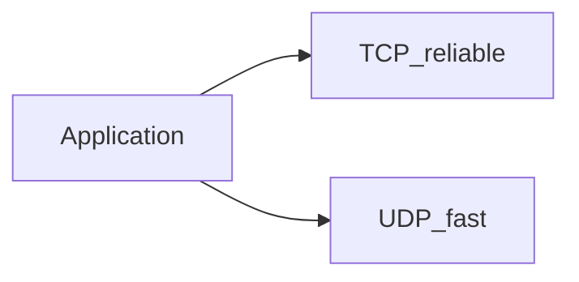

# TCP and UDP

## What is it, in one line?

**TCP** delivers a **reliable, ordered** byte stream; **UDP** sends **fast datagrams** with no delivery guarantee.

---

## Why it exists

Different apps need different guarantees. Email and web pages need reliability; live video prefers low latency over retransmitting old frames.

---

## TCP (Primer)

- **Connection-oriented** — handshake, teardown
- **Sequence numbers + ACKs** — retransmit on loss
- **Flow control & congestion control** — fair sharing
- **Cost:** latency and overhead vs UDP

**Use TCP when:** data must arrive complete and ordered—HTTPS, SQL connections, SMTP, SSH.

**Scaling note:** Many open TCP connections → memory; use **connection pooling** to DB/cache; keep-alive tuning on HTTP.

---

## UDP (Primer)

- **Connectionless** — no handshake
- May arrive **out of order** or **not at all**
- Supports **broadcast** (e.g. DHCP before IP assigned)
- **No** built-in congestion control—apps implement if needed

**Use UDP when:** low latency beats reliability—VoIP, Zoom, live games, DNS queries, QUIC foundation.

**Real-world:** Zoom uses UDP-based media with app-layer FEC; retransmitting 500 ms old audio is useless.

---

## Decision guide

| Need | Pick |
|------|------|
| Bank transfer API | TCP (HTTPS) |
| Multiplayer shooter position updates | UDP |
| File download | TCP |
| DNS lookup | UDP (also TCP fallback) |

---

## Interview questions

- “Why HTTP on TCP not UDP?” — Reliable complete documents; UDP would need custom reliability layer.
- “Memcached TCP vs UDP?” — Facebook discussed UDP for reduced latency in some paths; default often TCP for simplicity.

---

## Recap

- TCP: reliable, ordered, heavier.
- UDP: fast, best-effort, realtime-friendly.
- HTTP/APIs → TCP; many media/games → UDP.
- Next: [5.3-rpc-and-rest.md](5.3-rpc-and-rest.md)
