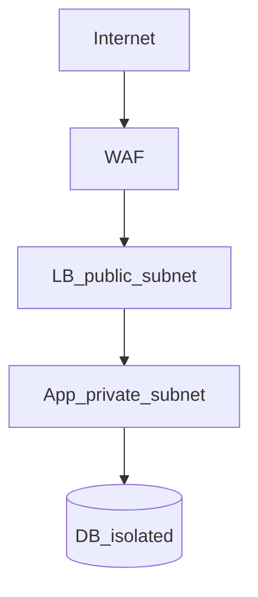

# Security in System Design

## What is it, in one line?

**Security** in architecture means protecting data and services in transit and at rest, validating all inputs, and granting least privilege.

---

## Why it exists

Large systems are attack surfaces—public APIs, databases, admin panels. Design choices (where TLS terminates, how auth works) affect breach blast radius.

Primer baseline for interviews:

---

## Encrypt in transit and at rest

- **TLS 1.2+** for all client and service communication (HTTPS, mTLS between services in zero-trust).
- **Encrypt disks** and database storage (AWS RDS encryption, S3 SSE).
- **Secrets** in vault/KMS—not git or env in images.

**Real-world:** PCI-DSS requires encryption for card data path; payment microservice isolated network segment.

---

## Input validation and injection

- **Sanitize/validate** all user input at trust boundaries.
- **Parameterized queries** — never concatenate SQL.
- Prevent **XSS** — encode output; CSP headers for web.
- **SSRF** — validate outbound URLs from server (webhooks, importers).

---

## Authentication and authorization

- **AuthN:** who you are (OAuth2/OIDC, sessions, JWT with short TTL).
- **AuthZ:** what you can do—check **every** request server-side; deny by default.
- **Least privilege** — DB user, IAM role, service account minimal permissions.

**Real-world:** AWS IAM roles for EC2 instead of long-lived keys on disk.

---

## Network segmentation

- Public subnet: LB only
- Private subnet: app servers
- Data subnet: DB no public IP
- **WAF** at edge for common HTTP attacks

---

## Logging and privacy

- Log security events (auth failures, admin actions) without **passwords/tokens**.
- Redact PII in logs per policy.

---

## DDoS and abuse

- Rate limiting (Week 0 practice), CDN absorption, autoscale with caps, captcha on auth endpoints.

---

## Interview checklist

- [ ] HTTPS end-to-end
- [ ] Auth + authz on APIs
- [ ] SQL injection prevention
- [ ] Secrets management
- [ ] Encryption at rest for sensitive data

---

## Recap

- Defense in depth: edge, app, data layers.
- Validate input; least privilege; encrypt everywhere sensitive.
- Next: [5.5-object-oriented-design.md](5.5-object-oriented-design.md)
