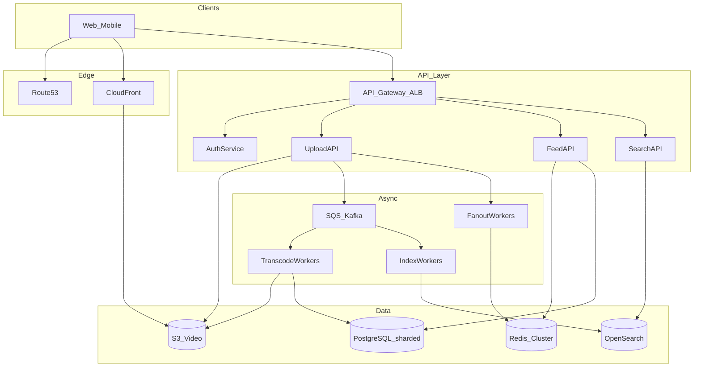

# FINAL MEGA PROJECT — Global Video + Social Platform

## Your capstone mission

Design **StreamSocial**: a global product combining **YouTube-like video upload/streaming** with **Instagram-like social feed** (follow, like, comment, home feed).

You must use concepts from **Weeks 0–6**. Spend **2–4 hours** solo before reading the reference solution.

---

## Product requirements

### Functional (v1)

1. Users register/login (email + OAuth stretch)
2. Upload video (up to 2 GB); processing produces 360p/720p/1080p
3. Stream playback with adaptive bitrate
4. Follow users; home feed shows new posts (video + caption) from followees
5. Like and comment on posts
6. Search videos by title/tags

### Out of scope (v1)

- Live streaming
- Direct messages
- Monetization/ads pacing engine

### Non-functional

- **100M registered**, **20M DAU**
- Each DAU watches **5 videos/day** avg 10 min; **5% DAU upload** 1 video/week
- Feed load p95 < **800 ms**
- Video start p95 < **2 s** (good network)
- **99.9%** availability target
- Global users (US, EU, India)

---

## Deliverables (what you submit to yourself)

1. **Requirements table** (you write assumptions)
2. **Back-of-envelope** — QPS for reads/writes, storage/year for video
3. **Architecture diagram** (boxes + data flows)
4. **Deep dives** on at least **three**: upload pipeline, feed fan-out, video delivery
5. **Failure scenarios** — processing worker dies, region outage, viral video
6. **AWS (or cloud) mapping** — which services where

---

## Grading checklist (self-score /100)

| Section | Points | Done? |
|---------|--------|-------|
| Clear requirements + scope | 10 | |
| QPS + storage math reasonable | 15 | |
| High-level diagram complete | 15 | |
| Upload + transcode async path | 15 | |
| Feed design (fan-out hybrid) | 15 | |
| Video CDN + storage | 10 | |
| Search path | 5 | |
| Security + auth mentioned | 5 | |
| Scaling/failure trade-offs | 10 | |

**80+** = ready for senior-level mock interviews on combined media+social prompts.

---

## Hints (only if stuck)

Hint tier 1 — component list

Auth service, API gateway, upload service (presigned S3), transcode queue + workers, metadata DB, object storage, CDN, feed service, graph service, search index, Redis caches, notification queue.

Hint tier 2 — numbers starter

Views/day ≈ 20M × 5 = 100M views/day → ~1.2k view starts/s avg, peak ~5–10k/s.  
Uploads/week = 20M × 0.05 / 7 ≈ **140k uploads/day** → ~1.6/s avg (processing heavy not QPS heavy).  
Storage: if avg 500 MB per uploaded source and 140k/day → **70 TB/day** raw — lifecycle to cheaper tiers; store renditions not infinite originals policy.

---

# Reference Solution

**Stop here if you have not attempted the design.**

---

## 1. Requirements (locked)

- v1 features as above; eventual consistency for counts; strong auth for account
- Read-heavy: **views + feed ≫ uploads**
- Multi-region **read**; writes primary region or per-user home region (simplified: primary US-East, CDN global)

---

## 2. Estimates

| Metric | Calculation | Result |
|--------|-------------|--------|
| View starts/day | 100M | |
| View QPS avg | 100M/86400 | ~1.2k/s, peak **~6k/s** |
| Feed loads/day | 20M × 3 | 60M → ~700/s peak **~3k/s** |
| Uploads/day | ~140k | ~1.6/s (async workers dominate) |
| Metadata storage | posts, users, comments | PostgreSQL + sharding later |
| Video storage | 70 TB/day raw | S3 + lifecycle; transcode to HLS segments |

---

## 3. High-level architecture

---

## 4. Deep dive — Upload & transcode

1. Client requests **presigned S3 URL** (`POST /videos/init`) — upload direct to S3 (no bytes through API).
2. On complete webhook/S3 event → message **`VideoUploaded`** queue.
3. **Transcode workers** (ECS/Lambda+MediaConvert): produce HLS renditions → S3 `/{video_id}/hls/...`
4. Update `videos` row: status `ready`, paths, duration.
5. Publish **`VideoReady`** → search indexer + **fan-out worker** pushes post id to followers’ feeds.

**Failure:** retry transcode; dead-letter queue; status `failed` in UI.

**Real-world parallel:** YouTube uses massive async pipeline; user sees “processing” until ready.

---

## 5. Deep dive — Video delivery

- Playback URL points to **CDN** (CloudFront) in front of S3 or MediaPackage.
- **Adaptive bitrate** HLS/DASH — player switches 360p/720p by bandwidth.
- Popular videos fully edge-cached; long tail from origin.

**Latency:** CDN POP near user; **2 s start** achievable with segment size tuning + prefetch.

---

## 6. Deep dive — Feed (hybrid fan-out)

- On **VideoReady**, fan-out post `post_id` to followers’ Redis ZSET `feed:{user_id}` (timestamp score).
- **Celebrity** (>1M followers): skip full fan-out; merge celebrity posts at **read** from `celebrity_posts` list.
- Feed read: top 50 ids from Redis → batch get post metadata (+ video thumb URL from CDN) → return JSON.

Same hybrid as [6.3-design-twitter-timeline-and-search.md](6.3-design-twitter-timeline-and-search.md).

---

## 7. Search, likes, comments

- **OpenSearch** index on title, tags, creator; async from `VideoReady`
- Likes: Redis counter + periodic flush to PostgreSQL; eventual OK
- Comments: PostgreSQL `comments(post_id)` shard by post_id; cache hot threads

---

## 8. Data model (sketch)

- `users(id, handle, ...)`
- `videos(id, owner_id, s3_key, status, created_at)`
- `posts(id, video_id, caption, created_at)`
- `follows(follower_id, followee_id)`
- `likes(user_id, post_id)`
- `comments(id, post_id, user_id, text, created_at)`

Indexes: `follows(follower_id)`, `posts(user_id, created_at)`, `videos(owner_id)`.

---

## 9. Security

- OAuth2/JWT; HTTPS only
- Presigned S3 URLs time-limited
- AuthZ: only owner deletes video
- WAF; rate limits on upload init
- Encrypt S3/RDS; KMS keys

---

## 10. Scale & failure

| Event | Response |
|-------|----------|
| Viral video | CDN absorbs view traffic; shield origin |
| Redis node loss | Cluster failover; rebuild feed from PostgreSQL (slow path) |
| Region down | Read-only degrade or failover DNS to secondary region (cold/warm DR) |
| Queue backlog | Scale workers; back pressure on upload if transcode >24h lag |

**DB scale path:** read replicas → shard `users` / `posts` by id → Cassandra for feeds at extreme scale.

---

## 11. What you learned (A–Z map)

| Week | Applied here |
|------|----------------|
| 0 | Requirements, math, 4-step framework |
| 1 | Latency vs throughput; eventual likes; availability 99.9% |
| 2 | DNS, CDN, LB, microservices |
| 3 | PostgreSQL + sharding path; object storage not BLOB in SQL |
| 4 | Redis feed cache; queues for transcode/index/fan-out |
| 5 | HTTPS, presigned URLs, REST APIs |
| 6 | Pastebin/Twitter/AWS patterns combined |

---

## Congratulations

If you completed this mega project and scored **80+** on the checklist, you have walked the **System Design Primer** from foundations through classic problems to a **production-style** capstone.

Return to [../00-START-HERE.md](../00-START-HERE.md) to review weak weeks or redo mock interviews timed 45 minutes.
