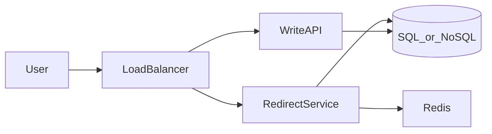

# Design Pastebin.com (or Bit.ly)

Classic Primer problem: **create short URLs**, **redirect**, optional **analytics**.

---

## Step 1 — Requirements

**Functional:**

- Create short link from long URL (custom alias optional stretch)
- Redirect HTTP 302/301 to long URL
- Expiration optional (stretch)

**Non-functional:**

- Public internet, anonymous create (or logged-in—clarify)
- **Read-heavy:** assume **100:1** read:write
- Low latency redirect (<100 ms p99 excluding network)
- Unique short codes

**Scale assumptions (interview):**

- 100M new URLs/month
- 10:1 read:write → adjust if interviewer says 100:1
- Store 10 years

---

## Step 2 — Estimates

Writes/month ≈ 100M → ~40 write/s avg, peak ~200/s  
Reads: 100× → ~4k avg, **~12–40k peak** with multiplier

Row ~500 bytes → 100M/mo × 500 B × 120 mo ≈ **6 TB** + indexes → plan **10–15 TB**

---

## Step 3 — High-level design



Separate **write** and **read** paths optionally (read path optimized).

---

## Step 4 — Core components

### API

- `POST /api/v1/urls` `{ "long_url": "..." }` → `{ "short_url": "https://pb/Ab3x9" }`
- `GET /{code}` → 302 Location: long_url

### Short code generation

| Option | Notes |
|--------|-------|
| Base62 of auto-increment ID | Needs distributed ID (Snowflake, DB sequence per shard) |
| MD5(long_url + salt) truncate 7 chars | Collision → retry with salt |
| Random 7-char | Check uniqueness in DB |

**Real-world:** Bit.ly uses short keys; collision handling mandatory.

### Data model

**SQL:**

```sql
urls (
  id BIGINT PK,
  short_code VARCHAR(7) UNIQUE,
  long_url TEXT,
  created_at TIMESTAMP,
  expires_at TIMESTAMP NULL
);
INDEX(short_code);
```

**NoSQL:** DynamoDB partition key `short_code`, attributes `long_url`, TTL.

### Redirect path

1. Lookup Redis `code → long_url`
2. Miss → DB → populate cache (TTL 24h)
3. 302 redirect (301 if permanent marketing links)

---

## Step 5 — Scale

- **Cache** almost all reads—Redis cluster; hot celebrity links local L1 optional
- **DB:** Read replicas for DB fallback; primary for writes
- **Sharding:** shard by `short_code` hash when single DB exceeds capacity
- **CDN:** not for dynamic redirect unless edge workers (Cloudflare Workers) cache known codes
- **Rate limit** create API against abuse

**Analytics (stretch):** async queue + column store for click counts—don’t block redirect.

---

## Trade-offs

- **302 vs 301:** analytics vs SEO/cache
- **SQL vs NoSQL:** SQL fine until huge scale; Dynamo simple key lookup at scale

---

## Recap

Read-heavy URL service = **unique key generation + cache + indexed lookup**. Template for many key-value designs.

Next: [6.3-design-twitter-timeline-and-search.md](6.3-design-twitter-timeline-and-search.md)
