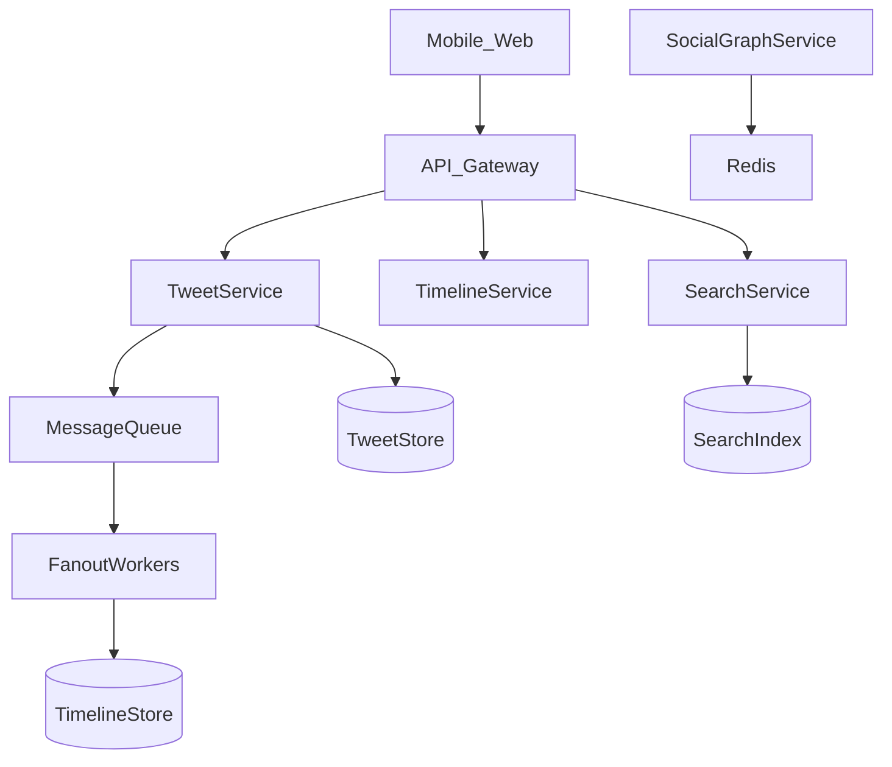

# Design Twitter Timeline and Search (Facebook Feed)

Hardest classic Primer problem: **publish tweet**, **home timeline**, **search**.

---

## Step 1 — Requirements

**Functional:**

- Post tweet (text, optional media refs)
- Follow users
- **Home timeline:** recent tweets from followees
- **Search:** tweets by keyword/hashtag (stretch: user search)

**Non-functional:**

- 300M DAU (round); 200M post/day; read timeline 5×/day/user
- Timeline latency <500 ms
- Eventual consistency OK for fan-out (likes/views)

---

## Step 2 — Estimates

Posts/day = 200M → ~2.3k write/s peak ~7k  
Timeline reads: 300M × 5 = 1.5B/day → ~17k avg, **~50–100k peak**

Media stored in **object storage** (separate from tweet metadata).

---

## Step 3 — High-level

---

## Step 4 — Core components

### Tweet service

- `POST /tweets` → store tweet row `{tweet_id, user_id, text, created_at}`
- Return tweet_id immediately

### Social graph

- `follows(follower_id, followee_id)` — store adjacency lists or graph DB
- Cache **followers** and **followees** lists in Redis

### Fan-out strategies (critical)

| Model | Pros | Cons |
|-------|------|------|
| **Fan-out on write** | Fast read timeline | Slow for celebrities (millions followers) |
| **Fan-out on read** | Fast post | Slow timeline read for heavy followees |
| **Hybrid** | Balance | Complexity |

**Hybrid (real-world Twitter approach):**

- Normal users: **push** tweet ids into followers’ timeline caches (Redis sorted sets by time)
- Celebrities: **pull** merge at read time from celebrity tweet list

### Timeline read

1. Get timeline tweet ids (precomputed ZSET `timeline:user_id`)
2. **MGET** tweet bodies from cache/DB
3. Merge celebrity tweets if hybrid

### Search

- Async pipeline: tweet created → indexer → **Elasticsearch** inverted index
- Query `GET /search?q=hello` → ES → tweet ids → hydrate tweets

---

## Step 5 — Scale

- Shard tweets by `tweet_id` or `user_id`
- Timeline Redis: memory bound—trim to last N tweets (800)
- **Hot users:** special celebrity list table
- Multi-region: geo-replicate read path; write to primary region or CRDT-style (advanced)

---

## Real-world

Twitter historically evolved fan-out architecture; Facebook uses similar hybrid with caching layers (TAO paper).

---

## Recap

Feed = **graph + fan-out policy + cache**. Search = **async index**. Say hybrid aloud in interviews.

Next: [6.4-design-web-crawler.md](6.4-design-web-crawler.md)
