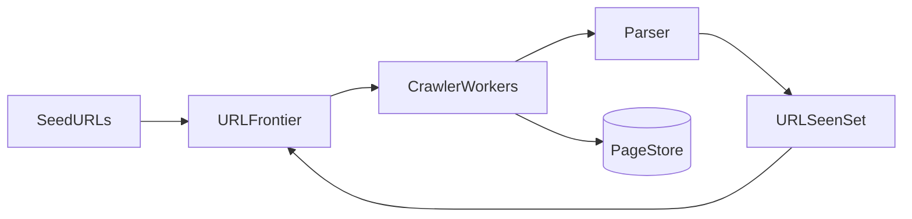

# Design a Web Crawler

**Crawl the web**, fetch pages, extract links, respect politeness, store for search indexing.

---

## Step 1 — Requirements

- Seed URLs → discover links → fetch HTML
- **Politeness:** rate limit per domain; obey robots.txt
- **Dedupe:** don’t refetch same URL
- Store raw page + metadata for indexer
- Scale to **billions** of pages (batch/crawl farm)

---

## Step 2 — High-level

---

## Step 3 — Core components

### URL frontier

- **Priority queues** per domain (BFS vs importance)
- **Delay queue** per host — last fetch time + min interval

### Dedupe

- **Bloom filter** in memory for fast “probably seen”
- **DB/KV** (`url_hash → status`) for definite dedupe

### Fetcher worker

1. Pop URL from frontier
2. HTTP GET (robots check first)
3. Store response body in **S3** + metadata `{url, status, checksum, fetch_time}`
4. Parser extracts `<a href>` → normalize URL → enqueue if new

### Politeness

- `robots.txt` cache per domain
- Max N concurrent fetches per domain (e.g. 1–2)

---

## Step 4 — Scale

- **Horizontal workers** — partition frontier by hash(domain) or shard id
- **DNS caching**, connection pooling per host
- **Retry** with exponential backoff on 5xx
- **Checksum** detect content change for recrawl scheduling

**Real-world:** Googlebot distributed crawl; Bing similar architecture.

---

## Failure modes

- Poison URL infinite loop → max depth, max redirects
- Spider trap → URL pattern filters
- Hot domain overload → strict rate cap

---

## Recap

Crawler = **frontier + dedupe + polite fetch + parse loop**. Foundation for search engine indexing.

Next: [6.5-design-mint.md](6.5-design-mint.md)
