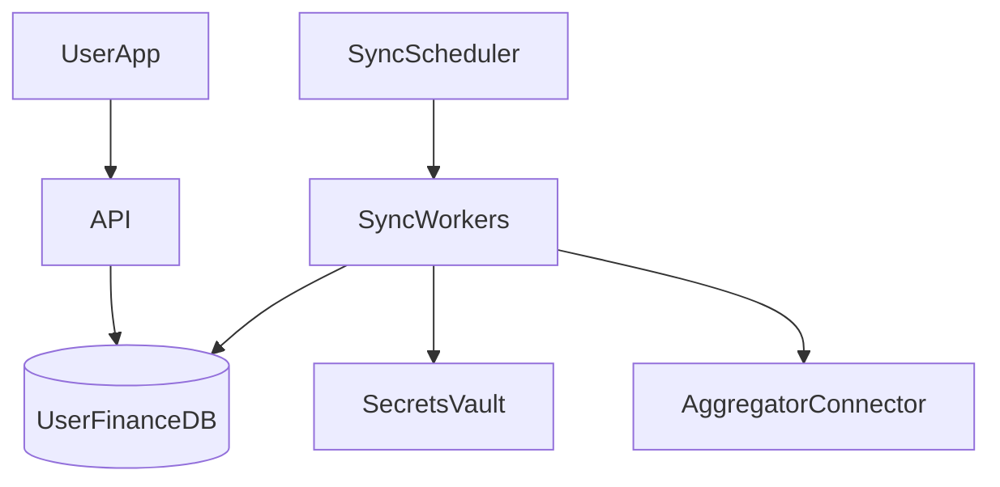

# Design Mint.com (Personal Finance Aggregation)

**Aggregate** user accounts from many banks, **normalize** transactions, show **dashboard**.

---

## Step 1 — Requirements

- Link bank/credit accounts (credentials or OAuth aggregator)
- Periodic **sync** transactions
- Categorize spending, budgets, alerts
- **High security** — financial data
- Millions of users; sync daily/hourly

---

## Step 2 — High-level

---

## Step 3 — Core components

### Account linking

- Prefer **Plaid/Yodlee**-style OAuth/API—not store raw passwords if avoidable
- If credentials required: encrypt with **KMS**, never log

### Sync pipeline

1. Scheduler enqueues `sync_job(user_id, account_id)`
2. Worker fetches new transactions from bank API
3. **Normalize** to canonical schema `{date, amount, merchant, category}`
4. **Dedupe** by `(account_id, external_tx_id)`
5. Store + update aggregates

### Data model

- `users`, `accounts`, `transactions`, `categories`, `budgets`
- Index `(user_id, date)` for dashboard queries

### Categorization

- Rules engine + ML model (async) for merchant → category

---

## Step 4 — Scale & security

- **Queue** sync jobs; rate limit per bank API terms
- **Shard** by `user_id`
- **Encrypt at rest**; TLS in transit; audit access
- **Read replicas** for dashboard; cache monthly summaries in Redis

**Real-world:** Mint/Intuit uses aggregator partners and strict compliance (SOC2).

---

## Recap

Aggregation = **secure credentials + scheduled sync + dedupe + normalized schema**.

Next: [6.6-design-social-network-data-structures.md](6.6-design-social-network-data-structures.md)
