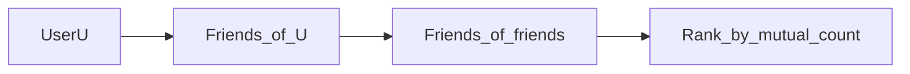

# Design Social Network Data Structures

Focus: **friendship graph**, **recommendations**, efficient **queries**—not full Twitter feed (see 6.3).

---

## Step 1 — Requirements

- User profiles
- **Friend** relationship (bidirectional or follow model—clarify)
- **Friend of friend** suggestions
- **Shortest path** “how you know X” (stretch)
- 500M users, avg 200 friends

---

## Step 2 — Data structures

### Adjacency list (per user)

Store `friends(user_id) → set<user_id>` in:

- **SQL** join table `friendships(user_a, user_b)` with indexes both ways
- **Graph DB** (Neo4j) for traversals
- **Redis sets** for hot friend lists cache

### Follow vs symmetric friend

| Model | Storage |
|-------|---------|
| Facebook friend (mutual) | Edge after accept; store once normalized `(min_id, max_id)` |
| Twitter follow | `followers` + `following` separate adjacency lists |

---

## Step 3 — Key operations

### Check friendship

- O(1) set lookup or indexed SQL query

### Mutual friends

- Intersect two friend sets — smaller set iterate, check membership in larger

### People you may know

- **Candidates** = union of friends-of-friends minus self minus existing friends
- Rank by **mutual friend count**
- Precompute top-K nightly for inactive users; realtime for active (cache)

### Scale note

500M × 200 edges = 100B relationships — **not** one RDBMS row scan. Shard graph by `user_id`; store edges in distributed KV or graph partition.

---

## Step 4 — Storage choices

| Approach | When |
|----------|------|
| SQL edge table | Moderate scale, simple |
| Wide-column (Cassandra) | `user_id → friend_ids` partition |
| Graph DB | Heavy traversal queries, smaller scale per cluster |
| Precomputed offline (Spark) | PYMK at billion-user scale |

**Real-world:** Facebook TAO caches social graph; offline jobs for suggestions.

---

## Recap

Social graph = **adjacency lists + intersection for mutuals + batch precompute for recommendations**.

Next: [6.7-design-key-value-store.md](6.7-design-key-value-store.md)
