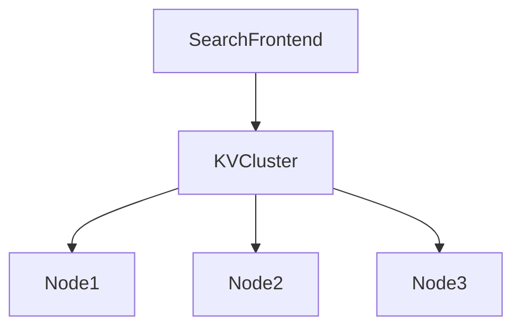

# Design a Key-Value Store for a Search Engine

Primer “query cache” problem: **KV store** backing **search result caching** and fast lookup by query hash.

---

## Step 1 — Requirements

- `put(key, value)` / `get(key)`
- Values: serialized search result lists (page ids, snippets)
- **High read QPS** from search frontends
- Durability optional for cache layer (can rebuild from index)
- Horizontal scale across machines

---

## Step 2 — High-level

---

## Step 3 — Core design

### Partitioning (sharding)

- `shard = hash(key) mod N` or **consistent hashing** (minimal remapping when N changes)
- Each node owns key range; **virtual nodes** for balance

### Replication

- Each key replicated to **W** writers, **R** readers quorum (Dynamo-style tunable)
- For cache: **R=1, W=1** eventual OK; for durable metadata increase W

### Storage engine (per node)

- In-memory hash table + **append-only log** on disk for recovery
- Or **LSM-tree** (LevelDB/RocksDB style) for large values

### Conflict resolution

- **Last-write-wins** with version vector/timestamp (simple cache)
- Vector clocks if merging (advanced)

---

## Step 4 — Search-specific usage

- Key = `hash(normalized_query + filters + page)`
- Value = compressed JSON of top 20 results
- TTL 5–60 min; invalidate on index major update

**Real-world:** Google/search engines cache query results aggressively; invalidation on fresh crawl waves.

---

## Step 5 — Ops

- **Gossip** membership (which nodes alive)
- **Hinted handoff** when node down briefly
- **Anti-entropy** repair replicas

---

## Recap

Distributed KV = **consistent hashing + replication + per-node storage engine**. Same ideas underpin DynamoDB/Cassandra internals at high level.

Next: [6.8-design-amazon-sales-ranking.md](6.8-design-amazon-sales-ranking.md)
