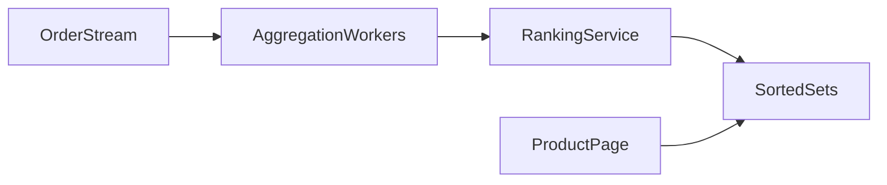

# Design Amazon Sales Ranking by Category

**Rank products** within category by sales velocity; update frequently; display **#1 Best Seller** badges.

---

## Step 1 — Requirements

- Track orders per product per category
- **Ranking** reflects recent sales (not lifetime only)—decay old sales
- Millions of products; thousands of categories
- Read rank on product page (high QPS)
- Updates near-real-time (minutes)

---

## Step 2 — High-level

---

## Step 3 — Core algorithms

### Sales score (simplified)

- Each sale adds points; **time decay** reduces old sales weight  
  `score = sum(sale_value * exp(-λ * hours_since_sale))`
- Or sliding window: sales in last 24h only

### Per-category leaderboard

- Redis **ZSET**: key `category:{id}`, member `product_id`, score `computed_score`
- `ZREVRANK` → rank O(log N)
- Top 100: `ZREVRANGE`

### Updates

- Order event → Kafka → worker updates product score → `ZADD` category ZSET

---

## Step 4 — Scale

- **Shard categories** — each ZSET fits memory; huge categories partition sub-ranks (subcategory)
- **Batch recompute** nightly full reconcile vs streaming approximate
- **Cache** rank on product page CDN edge with short TTL

**Real-world:** Amazon Best Sellers rank is proprietary; uses sales history + category tree + anti-gaming.

---

## Anti-abuse

- Exclude canceled/refunded orders
- Detect fake purchase spikes

---

## Recap

Leaderboards = **streaming aggregation + sorted sets + decay window**. Pattern for gaming scores, trending products, hashtags.

Next: [6.9-scale-to-millions-on-aws.md](6.9-scale-to-millions-on-aws.md)
