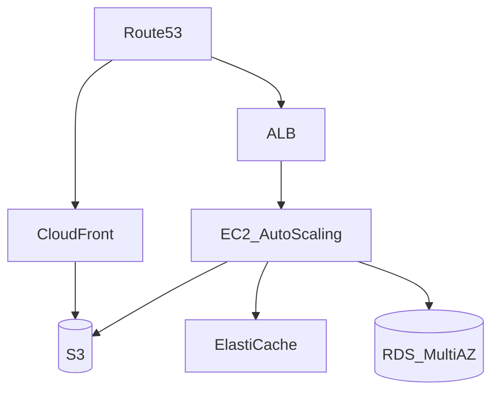

# Design a System That Scales to Millions of Users on AWS

Primer capstone: evolve **startup architecture → millions of users** using AWS building blocks.

---

## Step 1 — Starting point (0–10k users)

- Single **EC2** or Elastic Beanstalk
- **RDS PostgreSQL** single instance
- **S3** for uploads
- **Route 53** DNS → EC2 public IP
- Simple, cheap, one deploy unit

---

## Step 2 — Growth (10k–100k)

Pain: CPU on web+DB, deploy downtime, no redundancy.

**Changes:**

- **ALB** + **Auto Scaling Group** (2+ EC2 stateless app servers)
- RDS **Multi-AZ** failover
- **ElastiCache Redis** sessions + hot data
- **CloudFront CDN** for static assets on S3
- Move secrets to **Secrets Manager**

---

## Step 3 — Millions of users (100k–10M+)

**Bottlenecks:** DB writes/reads, job processing, observability.

**Changes:**

- **Read replicas** on RDS; route analytics to replica
- **SQS** + **ECS/Lambda workers** for async email, thumbnails, index
- **DynamoDB** or sharded RDS for high-write paths (sessions, events)
- **OpenSearch** for search
- **Multi-AZ** already; add **second region** DR (Route 53 failover) for critical apps
- **WAF** on ALB; **VPC** private subnets for app/DB
- **CloudWatch** metrics/alarms; **X-Ray** tracing

---

## Step 4 — Operational maturity

- **Infrastructure as Code** (Terraform/CDK)
- **Blue/green** or rolling deploys via CodeDeploy
- **RDS backups**, S3 lifecycle policies
- **Cost:** Reserved instances, S3 Intelligent-Tiering, right-size ASG

---

## Mapping Primer concepts → AWS

| Concept | AWS service |
|---------|-------------|
| DNS | Route 53 |
| CDN | CloudFront |
| Load balancer | ALB/NLB |
| Object storage | S3 |
| SQL | RDS/Aurora |
| Cache | ElastiCache |
| Queue | SQS/SNS/Kinesis |
| Search | OpenSearch |

**Real-world:** Airbnb, Netflix (hybrid AWS/custom) evolved similar stages—monolith → services → regional.

---

## Interview narrative

Tell story **in phases**—“first I’d measure; at X QPS I’d add cache; at Y storage I’d shard.” Avoid jumping to 50 services day one.

---

## Recap

AWS scaling story = **stateless ASG + Multi-AZ RDS + Redis + S3/CDN + async queues → replicas/shards/multi-region**.

Next: [6.10-FINAL-MEGA-PROJECT.md](6.10-FINAL-MEGA-PROJECT.md)
